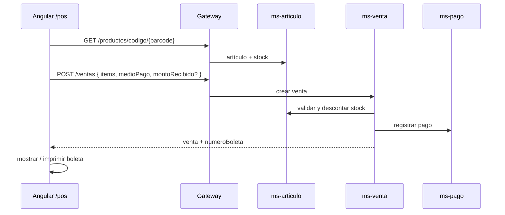

# NovaMarket → Minimarket POS

Plataforma de minimarket: rubros, artículos, existencias, ventas (caja), clientes y pagos.

## Nombres en Eureka / config (prefijo `ms-`)

| Carpeta | Eureka (`spring.application.name`) | Negocio |
|---------|--------------------------------------|---------|
| `services/ms-auth` | **ms-auth** | Login y roles |
| `services/ms-rubro` | **ms-rubro** | Rubros (API `/categorias`) |
| `services/ms-articulo` | **ms-articulo** | Artículos + stock |
| `services/ms-cliente` | **ms-cliente** | Clientes |
| `services/ms-venta` | **ms-venta** | Ventas POS |
| `services/ms-pago` | **ms-pago** | Pagos (efectivo, tarjeta, Yape) |

Config: `infra/config-repo/ms-*-dev.yml` y `ms-*-prod.yml`.

## ¿Dónde se guarda cada cosa al vender?

| Dato | Microservicio | Tabla / API | Para qué sirve |
|------|---------------|-------------|----------------|
| Líneas de la venta (qué se vendió, cantidades, precios) | **ms-venta** | `ordenes` + `orden_detalle` | Historial de ventas, boleta |
| Cobro (medio, monto, vuelto, estado APROBADO) | **ms-pago** | `pagos` | Trazabilidad del pago |
| Stock actual del artículo | **ms-articulo** | `productos.stock` | Cuánto queda en anaquel |
| Rubro del artículo | **ms-rubro** | `categorias` | Clasificación |
| Cliente de la venta (opcional) | **ms-cliente** | `clientes` | Fidelización / factura futura |

**No** se guarda la venta en “existencias/inventario”: la pantalla **Existencias** solo **lee** alertas de stock bajo desde ms-articulo. Un futuro **ms-inventario** registraría movimientos (entrada, merma, conteo).

Flujo al confirmar pago en caja:

1. `POST /api/v1/ventas` → ms-venta guarda venta + detalle, genera `numeroBoleta` (ej. `NM-00000001`), estado `PAGADO`.
2. ms-venta llama a ms-articulo → descuenta stock.
3. ms-venta llama a ms-pago → `POST /api/v1/pagos/registrar` con EFECTIVO / TARJETA / YAPE.
4. Angular muestra la boleta (imprimible).

Historial: menú **Ventas** → `GET /api/v1/ventas` (ms-venta).

## Flujo de caja (con pago)

## API principales (gateway `18080`)

| Método | Ruta | Servicio |
|--------|------|----------|
| POST | `/auth/login` | ms-auth |
| CRUD | `/api/v1/categorias/**` | ms-rubro |
| CRUD | `/api/v1/productos/**` | ms-articulo |
| GET | `/api/v1/productos/codigo/{codigo}` | ms-articulo |
| GET | `/api/v1/productos/alertas/stock-bajo` | ms-articulo |
| CRUD | `/api/v1/clientes/**` | ms-cliente |
| POST/GET | `/api/v1/ventas` | ms-venta |
| GET | `/api/v1/ventas/{id}` | ms-venta (boleta) |
| POST | `/api/v1/pagos/registrar` | ms-pago |

## Frontend Angular

| Ruta | Pantalla |
|------|----------|
| `/pos` | Caja: carrito, efectivo/tarjeta/Yape, boleta |
| `/ventas` | Historial y reimpresión de boleta |
| `/rubros` | CRUD rubros (API categorías) |
| `/articulos` | CRUD artículos |
| `/existencias` | Alertas stock bajo |

## Reinicio tras cambio de nombres `ms-*`

1. Config-server y Eureka.
2. Gateway.
3. Todos los microservicios (nuevo nombre en Eureka).
4. `ng serve` en Angular.

Usuarios: `cajero` / `cajero123`, `admin` / `admin123`.

## Fases siguientes

1. **ms-inventario**: movimientos de stock con historial (no solo el número en artículo).
2. Permisos por rol en gateway y menú.
3. Boleta PDF / serie SUNAT (si aplica).
4. Keycloak opcional.
