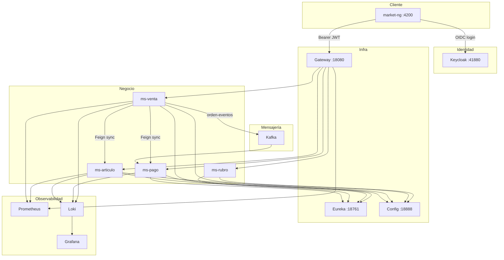
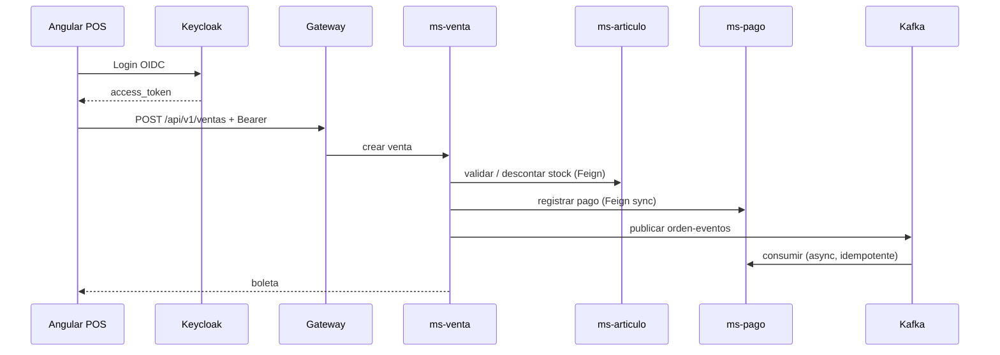

# Arquitectura

## Visión general

NovaMarket es una **plataforma POS distribuida** para supermercados y cadenas comerciales a gran escala: múltiples cajas, sedes, usuarios y transacciones concurrentes.

El cliente (Angular) consume una **API Gateway**; los servicios se registran en **Eureka** (varias instancias por dominio) y obtienen configuración desde **Config Server**. La identidad la provee **Keycloak** (OAuth2/OIDC) para toda la red de puntos de venta.

---

## Microservicios

| Servicio | Eureka ID | Responsabilidad |
|----------|-----------|-----------------|
| **ms-rubro** | `ms-rubro` | Categorías / rubros de productos |
| **ms-articulo** | `ms-articulo` | Artículos, stock, circuit breaker hacia rubro |
| **ms-venta** | `ms-venta` | Ventas POS, boletas, publicador Kafka |
| **ms-pago** | `ms-pago` | Registro de pagos, consumidor Kafka |

---

## Infraestructura transversal

| Componente | Función |
|------------|---------|
| **Config Server** | YAML centralizados (`infra/config-repo/*-{dev,prod}.yml`) |
| **Eureka** | Descubrimiento; el gateway usa `lb://nombre-servicio` |
| **Gateway** | Enrutamiento, CORS, validación JWT (resource server) |
| **Keycloak** | Login, realm `novamarket`, roles en claim `roles` |

---

## Flujo de una venta (caja)

---

## Resiliencia (Circuit Breaker)

`ms-articulo` consulta categorías en `ms-rubro` vía **OpenFeign**. **Resilience4j** protege la llamada:

- Instancia: `catalogo`
- Fallback: devuelve producto con `categoria: null`
- Endpoints: `/actuator/circuitbreakers`, `/actuator/circuitbreakerevents`

---

## Seguridad en capas

| Capa | Mecanismo |
|------|-----------|
| Gateway | OAuth2 Resource Server — `issuer-uri` Keycloak |
| ms-articulo | Mismo issuer; POST/PUT/DELETE productos → rol `ADMIN` |
| ms-rubro, venta, pago (vía GW) | Rutas públicas en gateway para operación POS (configurable) |

Detalle en [Seguridad](seguridad.md).

---

## Entornos

| Aspecto | DEV | PROD |
|---------|-----|------|
| Ejecución MS | Maven (`spring-boot:run`) | Docker |
| Red Docker | `market-dev-net` | `market-prod-net` |
| Perfil Spring | `dev` | `prod` |
| Puertos gateway | 18080 | 28082 |

Ver [Puertos](puertos.md) y [Desarrollo](desarrollo.md) / [Producción](produccion.md).
