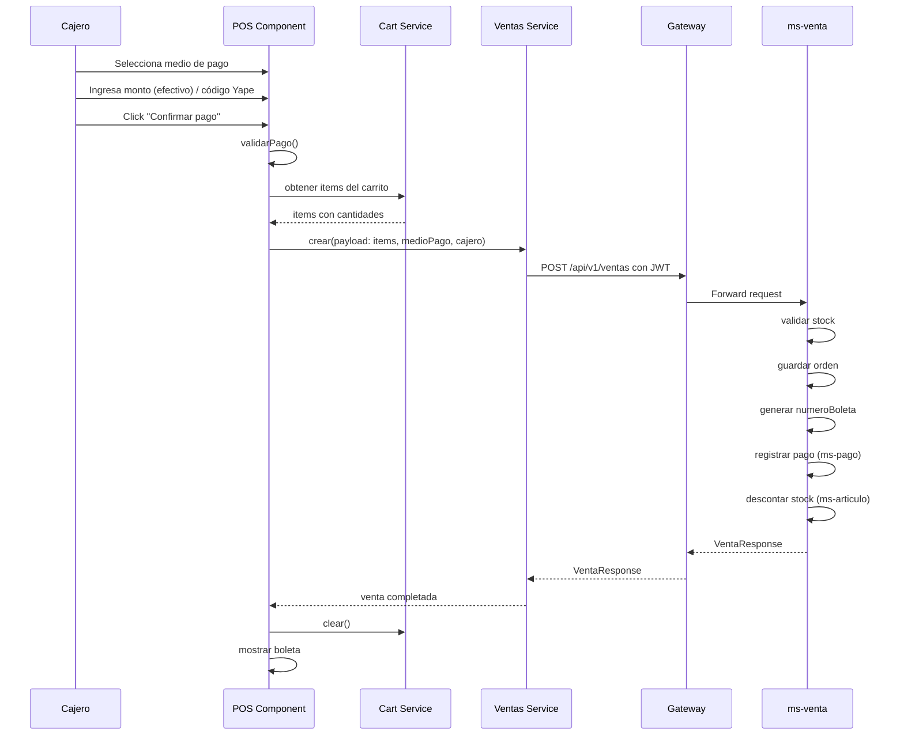
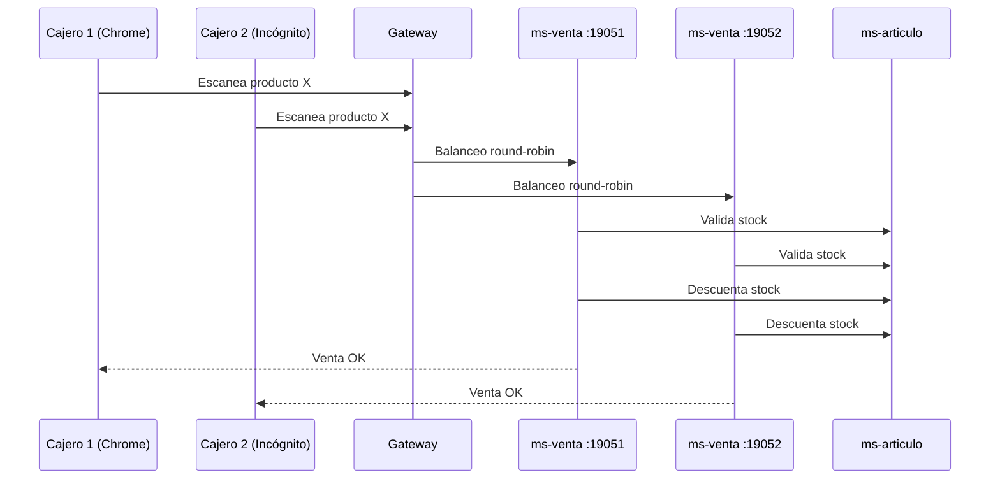

# Funcionalidad del Frontend — market-ng

Documentación detallada de la aplicación Angular **market-ng**, el cliente POS de NovaMarket.

---

## 1. Arquitectura del Frontend

### 1.1 Stack Tecnológico

| Tecnología | Versión | Uso |
|------------|---------|-----|
| Angular | 21.2.0 | Framework SPA |
| TypeScript | 5.9.2 | Lenguaje |
| Keycloak JS | 26.2.4 | Autenticación OIDC |
| RxJS | 7.8.0 | Programación reactiva |

### 1.2 Estructura de Módulos

```
clients/market-ng/src/app/
├── core/                    # Servicios y configuración central
│   ├── services/
│   │   ├── auth.service.ts          # Keycloak OIDC
│   │   ├── ventas.service.ts        # API ventas
│   │   ├── productos.service.ts     # API artículos
│   │   ├── rubros.service.ts        # API rubros
│   │   ├── boleta-print.service.ts  # Generación PDF boleta
│   │   └── pos-cart.service.ts      # Carrito de compras
│   ├── guards/
│   │   └── auth.guard.ts            # Guard de autenticación
│   └── interceptors/
│       └── jwt.interceptor.ts       # Inyección JWT en requests
├── pos/                     # Módulo Caja (POS)
│   ├── pos.ts                # Componente principal
│   ├── pos.html              # Template
│   └── pos.scss              # Estilos
├── ventas-historial/        # Módulo Historial de ventas
│   ├── ventas-historial.ts
│   ├── ventas-historial.html
│   └── ventas-historial.scss
├── articulos/               # Módulo Gestión de artículos
├── rubros/                  # Módulo Gestión de rubros
├── existencias/             # Módulo Existencias
├── boleta/                  # Módulo Boleta
└── app.routes.ts            # Rutas principales
```

---

## 2. Flujo de Autenticación

### 2.1 Login con Keycloak

```mermaid
sequenceDiagram
    participant U as Usuario
    participant A as Angular
    participant K as Keycloak
    participant G as Gateway
    participant MS as Microservicios

    U->>A: Click "Entrar con Keycloak"
    A->>K: Redirect a /auth
    K->>K: Login usuario/password
    K->>A: Redirect con code
    A->>K: Token exchange (code → JWT)
    K-->>A: Access Token (JWT)
    A->>A: Guardar token en localStorage
    A->>G: Request con Authorization: Bearer JWT
    G->>G: Validar JWT
    G->>MS: Forward request
    MS>>A: Response
```

### 2.2 Servicio de Autenticación

**Archivo:** `clients/market-ng/src/app/core/services/auth.service.ts`

```typescript
@Injectable({ providedIn: 'root' })
export class AuthService {
  private keycloak = new Keycloak({
    url: 'http://localhost:41880',
    realm: 'novamarket',
    clientId: 'market-ng',
  });

  async login(): Promise<void> {
    await this.keycloak.login();
  }

  async logout(): Promise<void> {
    await this.keycloak.logout();
  }

  getToken(): string {
    return this.keycloak.token || '';
  }

  getUsername(): string | undefined {
    return this.keycloak.tokenParsed?.preferred_username;
  }

  hasRole(role: string): boolean {
    return this.keycloak.hasRealmRole(role);
  }
}
```

### 2.3 Interceptor JWT

**Archivo:** `clients/market-ng/src/app/core/interceptors/jwt.interceptor.ts`

```typescript
export class JwtInterceptor implements HttpInterceptor {
  constructor(private auth: AuthService) {}

  intercept(req: HttpRequest<unknown>, next: HttpHandler): Observable<HttpEvent<unknown>> {
    const token = this.auth.getToken();
    if (token) {
      req = req.clone({
        setHeaders: {
          Authorization: `Bearer ${token}`,
        },
      });
    }
    return next.handle(req);
  }
}
```

---

## 3. Módulo Caja (POS) — `/pos`

### 3.1 Funcionalidades Principales

| Funcionalidad | Descripción |
|---------------|-------------|
| Escaneo de código | Búsqueda de producto por código de barras |
| Carrito de compras | Gestión de items, cantidades, subtotal |
| Medios de pago | Efectivo, Tarjeta (débito/crédito), Yape |
| Validación de stock | Verificación antes de agregar al carrito |
| Emisión de boleta | Generación PDF térmica 55mm |
| Concurrencia | Soporte multi-caja |

### 3.2 Flujo de Escaneo de Producto

**Archivo:** `clients/market-ng/src/app/pos/pos.ts`

```typescript
buscarPorCodigo() {
  const codigo = this.codigoBarras.trim();
  if (!codigo) return;

  this.error.set('');
  this.loading.set(true);

  // Llama al servicio de productos
  this.productosService.buscarPorCodigo(codigo).subscribe({
    next: producto => {
      try {
        this.agregarAlCarrito(producto);
        this.codigoBarras = '';
        this.ultimoEscaneo.set(producto.nombre);
        this.enfocarEscaneo();  // Auto-enfoque para escaneo rápido
      } catch (e) {
        this.error.set(e instanceof Error ? e.message : 'No se pudo agregar');
        this.enfocarEscaneo();
      }
      this.loading.set(false);
    },
    error: () => {
      this.error.set('Artículo no encontrado para ese código');
      this.codigoBarras = '';
      this.enfocarEscaneo();
      this.loading.set(false);
    },
  });
}
```

**Backend:** Gateway → `ms-articulo` → `GET /api/v1/articulos/codigo/{codigoBarras}`

### 3.3 Servicio de Carrito

**Archivo:** `clients/market-ng/src/app/pos/pos-cart.service.ts`

```typescript
@Injectable({ providedIn: 'root' })
export class PosCartService {
  private readonly lines = signal<CartLine[]>([]);

  readonly items = this.lines.asReadonly();

  readonly subtotal = computed(() =>
    this.lines().reduce((sum, line) => sum + line.precio * line.cantidad, 0),
  );

  addProduct(producto, cantidad = 1) {
    const existing = this.lines().find(line => line.productoId === producto.id);
    if (existing) {
      const nuevaCantidad = existing.cantidad + cantidad;
      if (nuevaCantidad > producto.stock) {
        throw new Error(`Stock insuficiente. Disponible: ${producto.stock}`);
      }
      this.lines.update(lines =>
        lines.map(line =>
          line.productoId === producto.id ? { ...line, cantidad: nuevaCantidad } : line,
        ),
      );
      return;
    }
    this.lines.update(lines => [...lines, { ...producto, cantidad }]);
  }

  updateCantidad(productoId: number, cantidad: number) {
    if (cantidad < 1) {
      this.remove(productoId);
      return;
    }
    if (cantidad > line.stock) {
      throw new Error(`Stock insuficiente. Disponible: ${line.stock}`);
    }
    this.lines.update(lines =>
      lines.map(line => (line.productoId !== productoId ? line : { ...line, cantidad })),
    );
  }

  remove(productoId: number) {
    this.lines.update(lines => lines.filter(line => line.productoId !== productoId));
  }

  clear() {
    this.lines.set([]);
  }
}
```

### 3.4 Flujo de Cobro



**Archivo:** `clients/market-ng/src/app/pos/pos.ts`

```typescript
private ejecutarCobro() {
  if (!this.puedeCobrar()) {
    this.error.set(this.mensajeValidacionPago());
    return;
  }

  const username = this.auth.username();
  if (!username) {
    this.error.set('Debe iniciar sesión');
    return;
  }

  this.pasoCheckout.set('procesando');
  this.loading.set(true);
  this.error.set('');

  const payload = {
    cajeroUsername: username,
    descuento: this.descuento || 0,
    medioPago: this.medioPago,
    montoRecibido: this.medioPago === 'EFECTIVO' ? Number(this.montoRecibido) : undefined,
    tipoTarjeta: this.medioPago === 'TARJETA' ? this.tipoTarjeta : undefined,
    codigoAutorizacion: this.medioPago === 'TARJETA' ? this.codigoAutorizacionTarjeta ?? undefined : undefined,
    codigoOperacion: this.medioPago === 'YAPE' ? normalizarCodigoYape(this.codigoYape) : undefined,
    items: this.cartItems().map(line => ({
      productoId: line.productoId,
      cantidad: line.cantidad,
    })),
  };

  this.ventasService.crear(payload).subscribe({
    next: venta => {
      this.loading.set(false);
      this.error.set('');
      this.ventaCompletada.set(venta);
      this.cart.clear();
      this.resetPago();
      this.pasoCheckout.set('cerrado');
      setTimeout(() => this.boletaPrint.emitirBoleta(venta), 0);
    },
    error: (err: unknown) => {
      this.error.set(this.resolverErrorCobro(err));
      this.pasoCheckout.set(this.medioPago === 'TARJETA' ? 'cobro' : 'resumen');
      this.loading.set(false);
    },
  });
}
```

### 3.5 Generación de Boleta

**Archivo:** `clients/market-ng/src/app/core/services/boleta-print.service.ts`

```typescript
@Injectable({ providedIn: 'root' })
export class BoletaPrintService {
  emitirBoleta(venta: VentaResponse, opciones: { guardar?: boolean; imprimir?: boolean } = {}): void {
    const guardar = opciones.guardar !== false;
    const imprimir = opciones.imprimir !== false;

    if (guardar) {
      this.descargarPdf(venta);
    }
    if (imprimir) {
      setTimeout(() => this.imprimir(venta), guardar ? 150 : 50);
    }
  }

  descargarPdf(venta: VentaResponse): void {
    const base = this.nombreArchivo(venta);
    const bytes = crearPdfTermico(this.generarTexto(venta), BOLETA_ANCHO_MM);
    this.descargarBlob(`${base}.pdf`, bytes, 'application/pdf');
  }

  generarTexto(venta: VentaResponse): string {
    const igv = calcularIgv(venta.total);
    const lineas: string[] = [];
    
    lineas.push(centro('NovaMarket'));
    lineas.push(centro('RUC 20123456789'));
    lineas.push(centro('BOLETA DE VENTA'));
    lineas.push(centro(venta.numeroBoleta ?? `Venta #${venta.id}`));
    
    for (const item of venta.items ?? []) {
      lineas.push(item.productoNombre);
      lineas.push(par(` ${item.cantidad} x S/${item.precioUnitario}`, `S/${item.subtotal}`));
    }
    
    lineas.push(par('TOTAL', `S/${venta.total}`));
    lineas.push(par('Pago', etiquetaMedioPago(venta.medioPago)));
    
    return lineas.join('\n');
  }
}
```

**Nota:** El PDF se genera manualmente sin librerías externas (ver `pdf-boleta.util.ts`).

---

## 4. Módulo Historial de Ventas — `/ventas`

### 4.1 Funcionalidades

| Funcionalidad | Descripción |
|---------------|-------------|
| Listado de ventas | Todas las ventas ordenadas por fecha descendente |
| Ver detalle | Items, totales, medio de pago de una venta específica |
| Reimpresión | Volver a emitir boleta de una venta anterior |

### 4.2 Componente

**Archivo:** `clients/market-ng/src/app/ventas-historial/ventas-historial.ts`

```typescript
export class VentasHistorial implements OnInit {
  ventas = signal<VentaResponse[]>([]);
  seleccionada = signal<VentaResponse | null>(null);

  cargar() {
    this.loading.set(true);
    this.ventasService.listar().subscribe({
      next: lista => {
        this.ventas.set(lista ?? []);
        this.loading.set(false);
      },
      error: (err: HttpErrorResponse) => {
        this.ventas.set([]);
        this.error.set(this.mensajeError(err));
        this.loading.set(false);
      },
    });
  }

  verBoleta(venta: VentaResponse) {
    this.seleccionada.set(venta);
  }

  reimprimirBoleta(venta: VentaResponse) {
    this.boletaPrint.emitirBoleta(venta, { guardar: false, imprimir: true });
  }
}
```

**Backend:** Gateway → `ms-venta` → `GET /api/v1/ventas`

---

## 5. Módulo Artículos — `/articulos`

### 5.1 Funcionalidades

| Funcionalidad | Descripción |
|---------------|-------------|
| Listar artículos | Todos los artículos con stock |
| Crear artículo | Nuevo producto con código de barras |
| Editar artículo | Modificar precio, stock, rubro |
| Eliminar artículo | Solo rol admin |
| Buscar por código | Para escaneo en caja |

### 5.2 Validaciones

- Código de barras único
- Precio mayor a 0
- Stock no negativo
- Rubro obligatorio

---

## 6. Módulo Rubros — `/rubros`

### 6.1 Funcionalidades

| Funcionalidad | Descripción |
|---------------|-------------|
| Listar rubros | Categorías disponibles |
| Crear rubro | Nueva categoría |
| Editar rubro | Modificar nombre/descripción |
| Eliminar rubro | Solo admin, verifica dependencias |

---

## 7. Módulo Existencias — `/existencias`

### 7.1 Funcionalidades

| Funcionalidad | Descripción |
|---------------|-------------|
| Alertas stock bajo | Artículos por debajo del mínimo |
| Movimiento de inventario | Ajustes manuales de stock |
| Historial de movimientos | Registro de cambios |

### 7.2 Lógica de Alertas

```typescript
alertasStockBajo(): Observable<ProductoResponse[]> {
  return this.productosService.listar().pipe(
    map(productos => productos.filter(p => p.stock <= p.stockMinimo))
  );
}
```

**Backend:** Gateway → `ms-articulo` → `GET /api/v1/articulos/alertas/stock-bajo`

---

## 8. Rutas y Guards

### 8.1 Configuración de Rutas

**Archivo:** `clients/market-ng/src/app/app.routes.ts`

```typescript
export const routes: Routes = [
  { path: '', redirectTo: '/pos', pathMatch: 'full' },
  { path: 'pos', loadComponent: () => import('./pos/pos.component').then(m => m.Pos), canActivate: [() => inject(AuthGuard).canActivate()] },
  { path: 'ventas', loadComponent: () => import('./ventas-historial/ventas-historial.component').then(m => m.VentasHistorial), canActivate: [() => inject(AuthGuard).canActivate()] },
  { path: 'articulos', loadComponent: () => import('./articulos/articulos.component').then(m => m.Articulos), canActivate: [() => inject(AuthGuard).canActivate()] },
  { path: 'rubros', loadComponent: () => import('./rubros/rubros.component').then(m => m.Rubros), canActivate: [() => inject(AuthGuard).canActivate()] },
  { path: 'existencias', loadComponent: () => import('./existencias/existencias.component').then(m => m.Existencias), canActivate: [() => inject(AuthGuard).canActivate()] },
];
```

### 8.2 Guard de Autenticación

```typescript
@Injectable({ providedIn: 'root' })
export class AuthGuard implements CanActivateFn {
  constructor(private auth: AuthService, private router: Router) {}

  canActivate(): boolean {
    if (!this.auth.getToken()) {
      this.router.navigate(['/auth']);
      return false;
    }
    return true;
  }
}
```

---

## 9. Control de Acceso por Rol

### 9.1 Permisos por Pantalla

| Pantalla | Admin | Supervisor | Cajero |
|----------|-------|------------|--------|
| `/pos` | ✅ | ❌ | ✅ |
| `/ventas` | ✅ | ✅ | ✅ |
| `/articulos` | ✅ (CRUD) | ✅ (CR) | ❌ |
| `/rubros` | ✅ (CRUD) | ✅ (CR) | ❌ |
| `/existencias` | ✅ (RW) | ✅ (RW) | ✅ (RO) |

### 9.2 Implementación en Componentes

```typescript
// Ejemplo en pos.ts
canEdit(): boolean {
  return this.auth.hasRole('admin') || this.auth.hasRole('supervisor');
}
```

---

## 10. Optimizaciones y UX

### 10.1 Auto-enfoque para Escaneo Rápido

```typescript
private enfocarEscaneo() {
  setTimeout(() => this.codigoInput()?.nativeElement.focus(), 0);
}
```

### 10.2 Signals de Angular 21+

Uso de signals para reactividad eficiente:

```typescript
cartItems = computed(() => this.cart.items());
total = computed(() => this.cart.subtotal() - (this.descuento || 0));
```

### 10.3 Manejo de Errores

```typescript
private resolverErrorCobro(err: unknown): string {
  if (err instanceof HttpErrorResponse) {
    if (err.status === 400) return 'Datos de pago inválidos';
    if (err.status === 409) return 'Stock insuficiente';
    if (err.status === 503) return 'Servicio temporalmente no disponible';
  }
  return 'Error al procesar el cobro';
}
```

---

## 11. Demo Multi-Caja (Concurrencia)

### 11.1 Configuración

1. Levantar 2 instancias de `ms-venta` (puertos 19051 y 19052)
2. Verificar en Eureka: http://localhost:18761
3. Abrir 2 navegadores (Chrome + Incógnito)
4. Login con usuarios diferentes (cajero1, cajero2)

### 11.2 Flujo de Demo



**Resultado:** Ambas ventas completadas, stock compartido correctamente.

---

## 12. Evidencias para Sustentación

### 12.1 Capturas Requeridas

| Evidencia | Descripción |
|-----------|-----------|
| Login Keycloak | Pantalla de login con realm novamarket |
| Menú por rol | Captura menú admin vs cajero |
| Escaneo producto | Input de código + producto en carrito |
| Carrito completo | Múltiples items con totales |
| Cobro efectivo | Monto recibido, vuelto calculado |
| Boleta emitida | PDF con número NM-00000001 |
| Historial ventas | Listado con ventas recientes |
| Reimpresión | Diálogo de impresión |
| Multi-caja | 2 navegadores vendiendo en paralelo |
| Eureka 2 instancias | Dashboard con ms-venta ×2 |

### 12.2 Código a Mostrar

| Archivo | Líneas | Explicación |
|---------|--------|-------------|
| `pos.ts` | 103-145 | Escaneo y carrito |
| `pos.ts` | 262-311 | Cobro y orquestación |
| `pos-cart.service.ts` | 25-54 | Lógica carrito |
| `boleta-print.service.ts` | 18-28 | Emisión boleta |
| `auth.service.ts` | 15-35 | Keycloak OIDC |
| `jwt.interceptor.ts` | 8-20 | Inyección JWT |

---

## 13. Troubleshooting Frontend

| Problema | Causa | Solución |
|----------|-------|----------|
| 401 en requests | Token expirado | Logout y login nuevamente |
| CORS error | Gateway no configurado | Verificar `application.yml` de gateway |
| Carrito no limpia | Signal no actualizado | Verificar `cart.clear()` después de venta |
| Boleta no descarga | Blob error | Verificar `crearPdfTermico` |
| Multi-caja falla | Solo 1 instancia ms-venta | Levantar segunda instancia |

---

## 14. Roadmap Frontend

| Feature | Estado | Prioridad |
|---------|--------|-----------|
| Offline mode (PWA) | Pendiente | Baja |
| Notificaciones push | Pendiente | Baja |
| Reportes PDF | Pendiente | Media |
| Integración pasarela real | Pendiente | Alta |
| Cámara para escaneo | Pendiente | Media |
