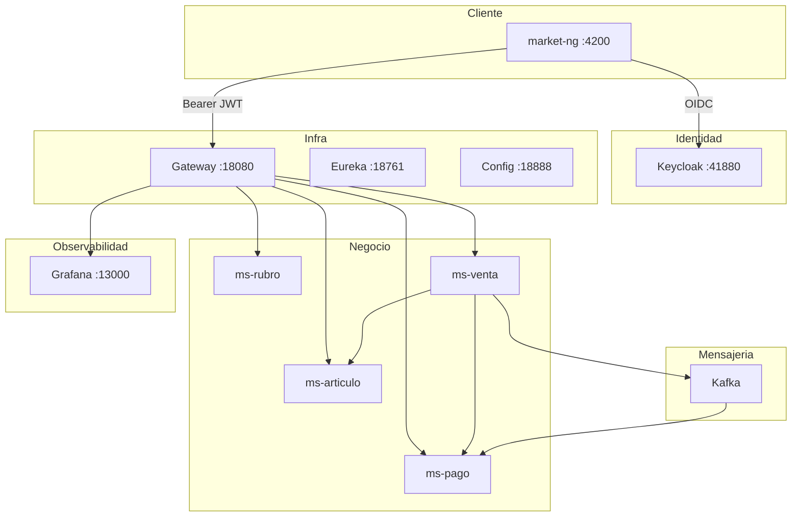

# NovaMarket — Sistemas Distribuidos

Curso práctico de **sistemas distribuidos con microservicios**, configuración centralizada, descubrimiento de servicios, Gateway, seguridad, resiliencia, mensajería asíncrona, consistencia distribuida, observabilidad e integración frontend.

**NovaMarket** es un entorno integrado para construir un **sistema POS de minimarket** mediante laboratorios reproducibles basados en **Docker** y **Spring Cloud**. El proyecto unifica infraestructura, microservicios, cliente Angular, mensajería, observabilidad e identidad con **Keycloak**.

---

## Producto del curso

!!! quote "Producto U3"
    **Sistema distribuido de microservicios end-to-end**, configurable, escalable, seguro, resiliente, consistente, observable, integrado con frontend y defendido técnicamente.

[Ver definición completa del producto →](producto-curso.md)

---

## Resultado esperado del curso

Al finalizar el curso, el estudiante **implementa, integra y sustenta** un sistema distribuido basado en microservicios. La solución debe ejecutarse de forma reproducible en **desarrollo** y **producción local**, exponer evidencias de configuración, registro, enrutamiento, escalado, seguridad, comunicación entre servicios, mensajería asíncrona, consistencia distribuida, observabilidad, persistencia e integración frontend.

El producto se presenta en **equipo**, pero cada estudiante **evidencia y defiende su aporte individual**.

---

## Contenido

### U1 — Sistema distribuido base orientado a producción

**Producto U1:** sistema distribuido base funcional, configurable y preparado para múltiples instancias.

| Sesión | Tema | Producto de sesión |
|--------|------|--------------------|
| S1 | Servicio base REST | `ms-rubro` — CRUD, PostgreSQL, Swagger, Actuator |
| S2 | Configuración centralizada | Config Server + `config-repo` dev/prod |
| S3 | Registro y descubrimiento | Eureka + instancias registradas |
| S4 | Gateway y balanceo | Punto único `:18080` |
| S5 | Evaluación U1 | Sistema base integrado |

### U2 — Sistema distribuido robusto

**Producto U2:** sistema seguro, resiliente, consistente, observable e integrado con frontend.

| Sesión | Tema | Producto de sesión |
|--------|------|--------------------|
| S6 | Comunicación resiliente | Circuit Breaker `ms-articulo` → `ms-rubro` |
| S7 | Seguridad distribuida | Keycloak + JWT + roles |
| S8 | Mensajería asíncrona | Kafka `orden-eventos` |
| S9 | Consistencia distribuida | Venta + pago + stock |
| S10 | Observabilidad | Prometheus, Loki, Grafana |
| S11 | Frontend | Angular POS (`market-ng`) |
| S12 | Evaluación U2 | Sistema robusto validado |

### U3 — Validación y consolidación

**Producto U3:** NovaMarket end-to-end, documentado y defendido.

| Sesión | Tema |
|--------|------|
| S13 | Validación end-to-end |
| S14 | Revisión y estabilización |
| S15 | Defensa técnica |
| S16 | Evaluación final |

[Índice completo de sesiones →](sesiones/indice.md)

---

## Arquitectura NovaMarket

[Diagrama y detalle →](arquitectura.md)

---

## Flujo de trabajo

1. Construir microservicios en `services/` (`ms-rubro`, `ms-articulo`, `ms-venta`, `ms-pago`).
2. Centralizar configuración en `infra/config-repo`.
3. Registrar servicios en **Eureka** y acceder vía **Gateway**.
4. Autenticar con **Keycloak** (realm `novamarket`).
5. Procesar ventas en **Angular POS** con eventos **Kafka**.
6. Monitorear con **Grafana**.
7. Validar end-to-end y defender el producto.

[Guía de arranque DEV →](desarrollo.md)

---

## Enlaces rápidos

| Recurso | Enlace |
|---------|--------|
| Arranque local | [Desarrollo (DEV)](desarrollo.md) |
| Producción Docker | [Producción (PROD)](produccion.md) |
| Keycloak y roles | [Seguridad](seguridad.md) |
| Puertos DEV/PROD | [Referencia de puertos](puertos.md) |
| Negocio POS | [Dominio de negocio](dominio-negocio.md) |
| Kafka | [Eventos](kafka-eventos.md) |
| Grafana | [Observabilidad](observabilidad.md) |
| Informes | [Plantilla](informe-template.md) · [Rúbrica](rubrica-evaluacion.md) |

---

## Accesos DEV (referencia)

| Servicio | URL |
|----------|-----|
| **App Angular** | http://localhost:4200 |
| **Gateway** | http://localhost:18080 |
| **Keycloak admin** | http://localhost:41880/admin |
| **Eureka** | http://localhost:18761 |
| **Grafana** | http://localhost:13000 |
| **Kafka UI** | http://localhost:41085 |

**Login app:** `cajero` / `cajero123` · `admin` / `admin123` · `supervisor` / `supervisor123`
