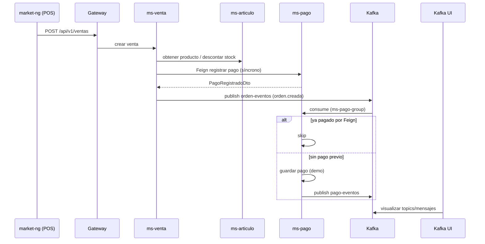

# 7. Kafka (si aplica) — NovaMarket

**Sí aplica.** El proyecto usa Apache Kafka (modo KRaft, sin Zookeeper) para desacoplar la notificación de ventas/órdenes y el procesamiento asíncrono de pagos. El flujo principal del POS combina **pago síncrono (OpenFeign)** con **eventos Kafka** para observabilidad y extensión futura.

**Infraestructura DEV:** `kafka/compose-dev.yml` — broker `localhost:41092`, UI `http://localhost:41085`, exporter `41308`.

---

## 7.1 Tópicos

| Tópico | Productor | Consumidor | Formato del evento |
|--------|-----------|------------|-------------------|
| `orden-eventos` | **ms-venta** (`ProductorOrden`) al crear venta vía `POST /api/v1/ventas` (`VentaServicio`) o al crear orden legacy vía `POST /api/v1/ordenes` (`OrdenServicio`) | **ms-pago** (`ConsumidorPago`, group `ms-pago-group`) | JSON (`JsonSerializer`), clase `EventoOrden`. **Clave:** `ordenId` (String). **tipoEvento** usado: `orden.creada`. Campos: `tipoEvento`, `ordenId`, `total`, `estado`, `origen`, `timestamp` (epoch ms). |
| `pago-eventos` | **ms-pago** (`ProductorPago`) tras procesar un evento de orden (solo si el pago no existía ya por API síncrona) | *Ninguno en el código actual* (tópico preparado para otros servicios / laboratorio) | JSON (`JsonSerializer`), clase `EventoPago`. **Clave:** `ordenId` (String). **tipoEvento:** `pago.aprobado` o `pago.rechazado`. Campos: `tipoEvento`, `ordenId`, `monto`, `estado`, `origen`, `timestamp`. |

### Ejemplo de mensaje — `orden-eventos`

```json
{
  "tipoEvento": "orden.creada",
  "ordenId": 12,
  "total": 4.90,
  "estado": "PAGADO",
  "origen": "ms-venta",
  "timestamp": 1717171717171
}
```

*(En API legacy `/api/v1/ordenes`, `estado` puede ser `PENDIENTE`.)*

### Ejemplo de mensaje — `pago-eventos`

```json
{
  "tipoEvento": "pago.aprobado",
  "ordenId": 12,
  "monto": 4.90,
  "estado": "APROBADO",
  "origen": "ms-pago",
  "timestamp": 1717171718200
}
```

### Configuración de nombres de tópicos

| Servicio | Propiedad | Valor |
|----------|-----------|--------|
| ms-venta | `app.kafka.topic.ordenes` | `orden-eventos` |
| ms-pago | `app.kafka.topic.ordenes` | `orden-eventos` |
| ms-pago | `app.kafka.topic.pagos` | `pago-eventos` |
| ms-pago | `app.kafka.group-id.pagos` | `ms-pago-group` |
| Ambos (DEV) | `spring.kafka.bootstrap-servers` | `localhost:41092` |

Los tópicos pueden crearse manualmente (`kafka/README.md`) o por auto-create del broker (`KAFKA_AUTO_CREATE_TOPICS_ENABLE: true` en DEV).

---

## 7.2 Flujo de eventos

### Flujo principal (venta desde el POS — Caja)

```text
1. Angular (market-ng) → POST /api/v1/ventas → Gateway (:18080) → ms-venta

2. ms-venta (VentaServicio), en la misma transacción de negocio:
   a. Valida stock (Feign → ms-articulo)
   b. Persiste la venta/orden en PostgreSQL (market_orden_db)
   c. Genera número de boleta
   d. Descuenta stock (Feign → ms-articulo)
   e. Registra pago de forma SÍNCRONA (Feign → ms-pago POST /api/v1/pagos/registrar)
   f. Publica evento asíncrono en Kafka → tópico "orden-eventos" (tipo orden.creada)

3. ms-pago (ConsumidorPago) escucha "orden-eventos":
   a. Si el tipo no es orden.creada → ignora
   b. Si ya existe pago para esa ventaId (paso 2.e) → skipped (no duplica)
   c. Si no hay pago: simula aprobación/rechazo (lógica demo) y guarda Pago
   d. Publica en "pago-eventos" (pago.aprobado / pago.rechazado)

4. (Opcional) Otros microservicios podrían consumir "pago-eventos" — no implementado aún.

5. Operador puede ver mensajes en Kafka UI (http://localhost:41085) y métricas en Prometheus (kafka-exporter).
```

### Diagrama



### Flujo alternativo (API legacy de órdenes)

`POST /api/v1/ordenes` → `OrdenServicio.crearOrden` persiste orden en estado **PENDIENTE** y publica `orden.creada` en `orden-eventos` **sin** pasar por el flujo completo del POS (sin pago Feign previo). En ese caso **ms-pago** sí puede crear el pago al consumir el evento.

### Relación síncrono vs asíncrono

| Aspecto | Mecanismo | Propósito |
|---------|-----------|-----------|
| Cobro en caja | Feign ms-venta → ms-pago | Respuesta inmediata al usuario (boleta, pagoId) |
| Notificación | Kafka `orden-eventos` | Desacoplar, auditar, practicar consumo |
| Resultado de pago async | Kafka `pago-eventos` | Extensión (notificaciones, inventario, etc.) |

### Cómo probar el flujo

1. `docker compose -f kafka/compose-dev.yml up -d`
2. Levantar **ms-venta** y **ms-pago** (Maven) con Kafka en `localhost:41092`
3. Realizar una venta en el POS
4. En Kafka UI → topic `orden-eventos` → ver mensaje JSON
5. Revisar logs de ms-pago (`status=skipped` si el pago ya se registró por Feign, o `status=processed` en flujo legacy)

### Servicios que no usan Kafka

| Componente | Kafka |
|------------|-------|
| ms-auth, ms-rubro, ms-articulo, ms-cliente, gateway | No productor/consumidor |
| ms-venta | Solo productor (`orden-eventos`) |
| ms-pago | Consumidor (`orden-eventos`) + productor (`pago-eventos`) |

---

*Referencias en repo: `services/ms-venta/.../VentaServicio.java`, `ProductorOrden.java`, `services/ms-pago/.../ConsumidorPago.java`, `ProductorPago.java`, `kafka/README.md`, `OBS-KAFKA-DEV.md`.*
