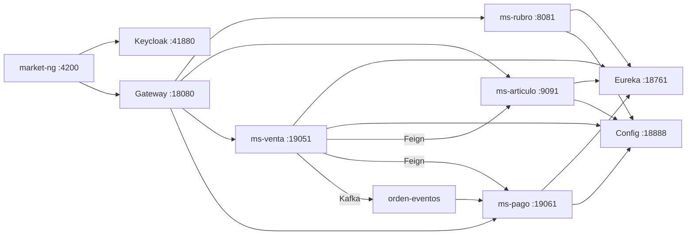
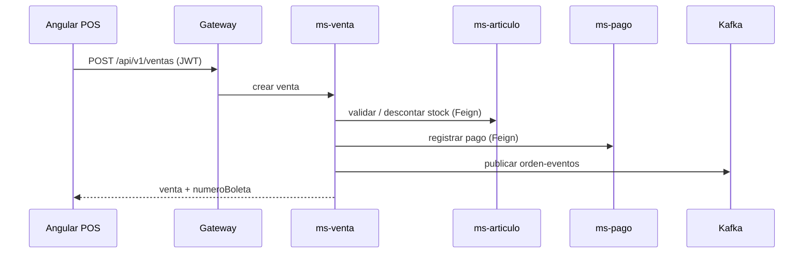

# Manual de funcionamiento — NovaMarket

Documento técnico-operativo: **cómo funciona el sistema**, componentes, flujos e integraciones.

---

## 1. Propósito del sistema

NovaMarket es una **plataforma de operación comercial** para retail con **múltiples cajas** y catálogo centralizado. Integra:

- Frontend Angular (**market-ng**)
- API Gateway + microservicios Spring
- Identidad **Keycloak**
- Mensajería **Kafka** (eventos)
- Observabilidad **Prometheus / Grafana / Loki**

---

## 2. Arquitectura general

Detalle: [Arquitectura](arquitectura.md)

---

## 3. Microservicios de negocio

| Servicio | Puerto DEV | Responsabilidad |
|----------|------------|-----------------|
| **ms-rubro** | 8081 | Rubros / categorías |
| **ms-articulo** | 9091 | Artículos, stock, circuit breaker → rubro |
| **ms-venta** | 19051 | Ventas, boletas, orquestación |
| **ms-pago** | 19061 | Registro de pagos, consumidor Kafka |

Cada uno tiene **PostgreSQL** propio (puertos 15432–15435 en DEV).

---

## 4. Infraestructura transversal

| Componente | Puerto DEV | Función |
|------------|------------|---------|
| Config Server | 18888 | YAML central (`infra/config-repo/*-dev.yml`) |
| Eureka | 18761 | Registro de instancias; gateway usa `lb://ms-*` |
| Gateway | 18080 | Entrada HTTP única, JWT Keycloak |
| Keycloak | 41880 | OIDC, realm `novamarket`, roles |

---

## 5. Flujo funcional: venta en caja

1. Angular envía ítems, medio de pago y cajero  
2. **ms-venta** persiste orden y detalle  
3. Descuenta stock en **ms-articulo**  
4. Registra pago en **ms-pago** (respuesta síncrona al cajero)  
5. Publica evento Kafka (asíncrono)  
6. UI muestra boleta

---

## 6. Seguridad

- Login: **Keycloak** (no ms-auth legacy)  
- Token JWT en header `Authorization: Bearer`  
- **ms-articulo:** valida JWT y roles (POST/PUT/DELETE restringidos)  
- **Gateway:** varias rutas en `permitAll` para pruebas; ms-articulo exige token en operaciones sensibles  

Usuarios demo: ver [Seguridad](seguridad.md) y [Manual de usuario](manual-usuario.md).

---

## 7. Comunicación entre servicios

| Patrón | Dónde | Para qué |
|--------|-------|----------|
| **OpenFeign** | ms-venta → ms-articulo, ms-pago; ms-articulo → ms-rubro | Llamadas HTTP síncronas |
| **Circuit breaker** | ms-articulo → ms-rubro (`/articulos/detalle/{id}`) | Fallback si rubro cae |
| **Kafka** | ms-venta → `orden-eventos`; ms-pago consume/publica | Eventos post-venta |

---

## 8. Escalado y concurrencia (multi-caja)

- Varias instancias de **ms-venta** en Eureka (ej. puertos 19051 y 19052)  
- Gateway balancea peticiones  
- **Stock compartido** (mismo artículo, un contador) — simula varias cajas en una tienda  
- Demo: dos navegadores con dos usuarios Keycloak vendiendo en paralelo  

Roadmap: inventario **por tienda/sede**.

---

## 9. Observabilidad

| Herramienta | Puerto DEV | Uso |
|-------------|------------|-----|
| Prometheus | 19090 | Métricas, targets UP |
| Grafana | 13000 | Dashboards (`admin`/`admin`) |
| Loki | 13100 | Logs vía Grafana Explore |

Guía: [Observabilidad](observabilidad.md)

---

## 10. Kafka

| Tópico | Productor | Consumidor |
|--------|-----------|------------|
| `orden-eventos` | ms-venta | ms-pago |
| `pago-eventos` | ms-pago | (extensión futura) |

UI: http://localhost:41085 — Detalle: [Kafka y eventos](kafka-eventos.md)

---

## 11. Arranque del sistema (DEV)

Orden recomendado:

1. `docker network create market-dev-net`  
2. Keycloak (`keycloak/start-dev.ps1`)  
3. Infra Maven: config-server, registry-server, gateway  
4. Postgres por microservicio (`compose-dev.yml`)  
5. Microservicios Maven: ms-rubro, ms-articulo, ms-venta, ms-pago  
6. (Opcional) Kafka + obs  
7. `ng serve` en `clients/market-ng`

Pasos completos: [Desarrollo](desarrollo.md) · Puertos: [Referencia](puertos.md)

---

## 12. APIs principales (Gateway :18080)

| Método | Ruta | Servicio |
|--------|------|----------|
| GET/POST | `/api/v1/rubros/**` | ms-rubro |
| GET/POST/PUT/DELETE | `/api/v1/articulos/**` | ms-articulo |
| POST/GET | `/api/v1/ventas` | ms-venta |
| POST | `/api/v1/pagos/registrar` | ms-pago |

---

## 13. Limitaciones actuales y roadmap

| Implementado | Planificado |
|--------------|-------------|
| Multi-caja (instancias ms-venta) | Tiendas/sedes (ej. Juliaca) |
| Stock global por artículo | Stock **por tienda** |
| Keycloak + roles | Usuario acotado por `tienda_id` |
| Kafka eventos venta/pago | Traslados entre tiendas, HQ analítica |

---

## 14. Equipo y sustentación

Guion de presentación frontend: [Sustentación del equipo](sustentacion-equipo.md)
