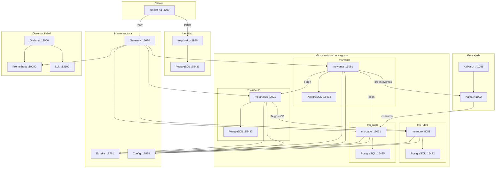
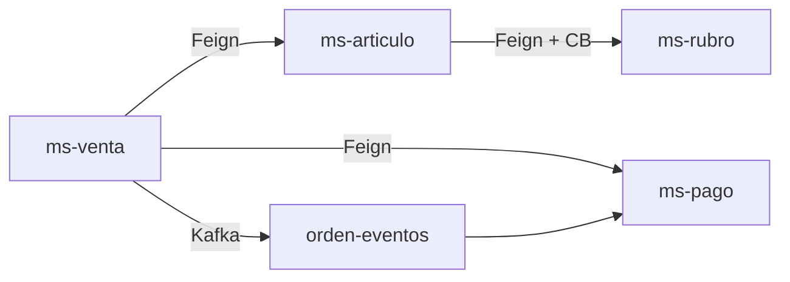
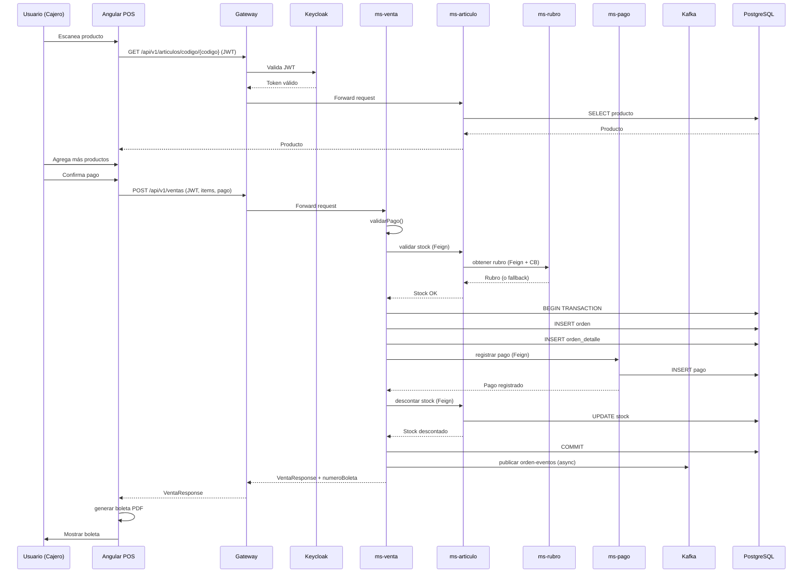
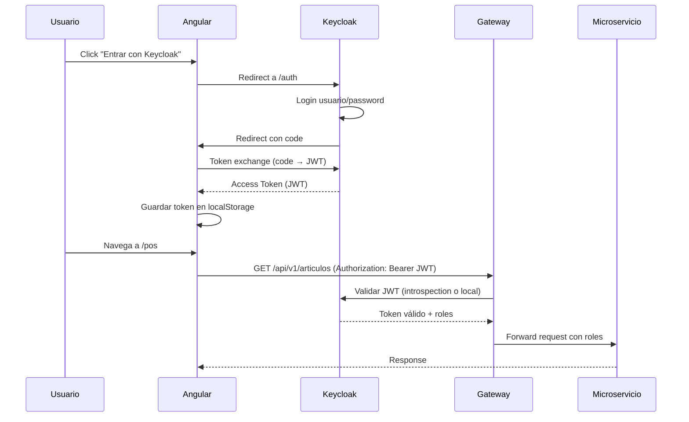

# Manual de funcionamiento — NovaMarket

Documento técnico-operativo detallado: **cómo funciona el sistema**, componentes, flujos, integraciones y arquitectura.

---

## 1. Propósito del sistema

NovaMarket es una **plataforma de operación comercial** para retail con **múltiples cajas** y catálogo centralizado. Integra:

- Frontend Angular (**market-ng**)
- API Gateway + microservicios Spring Boot
- Identidad **Keycloak** (OIDC)
- Mensajería **Kafka** (eventos asíncronos)
- Observabilidad **Prometheus / Grafana / Loki**
- Persistencia **PostgreSQL** por microservicio

**Objetivo:** Soportar operaciones concurrentes en múltiples puntos de venta con escalado horizontal.

---

## 2. Arquitectura general

### 2.1 Diagrama de alto nivel



Detalle completo: [Arquitectura](arquitectura.md)

### 2.2 Patrones arquitectónicos

| Patrón | Implementación | Beneficio |
|--------|----------------|-----------|
| **API Gateway** | Spring Cloud Gateway | Punto único de entrada, routing, JWT |
| **Service Discovery** | Eureka Server | Descubrimiento dinámico, balanceo de carga |
| **Centralized Config** | Spring Cloud Config | Configuración externa, ambientes dev/prod |
| **Circuit Breaker** | Resilience4j | Resiliencia ante fallos en cascada |
| **Event-Driven** | Kafka | Desacoplamiento, consistencia eventual |
| **Microservicios** | Spring Boot | Escalado independiente, despliegue ágil |

---

## 3. Microservicios de negocio

### 3.1 Tabla de servicios

| Servicio | Puerto DEV | Puerto PROD | Responsabilidad | Database |
|----------|------------|-------------|-----------------|----------|
| **ms-rubro** | 8081 | 28081 | Rubros / categorías | PostgreSQL 15432 / 25432 |
| **ms-articulo** | 9091 | 29091 | Artículos, stock, CB → rubro | PostgreSQL 15433 / 25433 |
| **ms-venta** | 19051 | 29051 | Ventas, boletas, orquestación | PostgreSQL 15434 / 29034 |
| **ms-pago** | 19061 | 29061 | Registro de pagos, Kafka | PostgreSQL 15435 / 29035 |

### 3.2 Dependencias entre servicios



**Notas:**
- **ms-venta** es el orquestador: coordina stock, pago y eventos
- **ms-articulo** tiene Circuit Breaker hacia **ms-rubro** (fallback si rubro cae)
- **Kafka** es opcional en DEV: la venta no falla si el broker no está activo

---

## 4. Infraestructura transversal

### 4.1 Componentes

| Componente | Puerto DEV | Puerto PROD | Función |
|------------|------------|-------------|---------|
| Config Server | 18888 | 28888 | YAML central (`infra/config-repo/*-yml`) |
| Eureka | 18761 | 28761 | Registro de instancias; gateway usa `lb://ms-*` |
| Gateway | 18080 | 28082 | Entrada HTTP única, JWT Keycloak, routing |
| Keycloak | 41880 | 41880 | OIDC, realm `novamarket`, roles, usuarios |

### 4.2 Config Server

**Repositorio:** `infra/config-repo/`

**Archivos:**
- `application.yml` — Configuración común
- `ms-rubro-dev.yml` — Config específica ms-rubro DEV
- `ms-articulo-dev.yml` — Config específica ms-articulo DEV
- `ms-venta-dev.yml` — Config específica ms-venta DEV
- `ms-pago-dev.yml` — Config específica ms-pago DEV
- `gateway-dev.yml` — Config específica gateway DEV
- `*-prod.yml` — Configuraciones de producción

**Ejemplo de configuración:**
```yaml
server:
  port: 8081
spring:
  application:
    name: ms-rubro
  datasource:
    url: jdbc:postgresql://localhost:15432/rubro_db
eureka:
  client:
    service-url:
      defaultZone: http://localhost:18761/eureka
```

### 4.3 Eureka Server

**Dashboard:** http://localhost:18761

**Servicios registrados:**
- `MS-RUBRO` — Instancias de ms-rubro
- `MS-ARTICULO` — Instancias de ms-articulo
- `MS-VENTA` — Instancias de ms-venta
- `MS-PAGO` — Instancias de ms-pago
- `GATEWAY` — Instancia del gateway

**Balanceo de carga:**
Gateway usa `lb://nombre-servicio` para balancear entre instancias registradas.

### 4.4 API Gateway

**Configuración de rutas:**
```yaml
spring:
  cloud:
    gateway:
      routes:
        - id: rubro-route
          uri: lb://MS-RUBRO
          predicates:
            - Path=/api/v1/rubros/**
        - id: articulo-route
          uri: lb://MS-ARTICULO
          predicates:
            - Path=/api/v1/articulos/**
        - id: venta-route
          uri: lb://MS-VENTA
          predicates:
            - Path=/api/v1/ventas/**
```

**Filtros:**
- JWT Filter: Valida token en header `Authorization: Bearer`
- CORS Filter: Permite requests desde Angular en localhost:4200

---

## 5. Flujo funcional: venta en caja

### 5.1 Diagrama de secuencia



### 5.2 Pasos detallados

1. **Escaneo de producto:**
   - Frontend llama a `GET /api/v1/articulos/codigo/{codigo}`
   - Gateway valida JWT con Keycloak
   - ms-articulo busca producto en PostgreSQL
   - Retorna nombre, precio, stock

2. **Construcción del carrito:**
   - Frontend mantiene carrito en memoria (PosCartService)
   - Valida stock antes de agregar
   - Calcula subtotal automáticamente

3. **Confirmación de pago:**
   - Frontend envía `POST /api/v1/ventas` con:
     - Items (productoId, cantidad)
     - Medio de pago (EFECTIVO/TARJETA/YAPE)
     - Monto recibido (efectivo)
     - Tipo tarjeta / código autorización (tarjeta)
     - Código operación Yape (Yape)
     - Cajero username

4. **Procesamiento en ms-venta:**
   - Valida datos de pago
   - Itera items y valida stock en ms-articulo
   - Calcula subtotal, descuento, total
   - Genera número de boleta: `NM-00000001`
   - Persiste orden y detalle en PostgreSQL

5. **Registro de pago:**
   - Llama a ms-pago vía Feign
   - ms-pago persiste pago en PostgreSQL
   - Retorna código autorización, referencia transacción

6. **Descuento de stock:**
   - Por cada item, llama a ms-articulo
   - ms-articulo actualiza stock en PostgreSQL
   - Si stock insuficiente, rollback transacción

7. **Publicación de evento Kafka:**
   - Publica `orden-eventos` con:
     - ordenId
     - total
     - estado
     - timestamp
   - ms-pago consume evento (asíncrono)
   - Si Kafka no está disponible, la venta no falla (try-catch)

8. **Generación de boleta:**
   - Frontend genera PDF térmica 55mm
   - Descarga archivo y abre diálogo de impresión

---

## 6. Seguridad

### 6.1 Flujo de autenticación



### 6.2 Configuración Keycloak

**Realm:** `novamarket`

**Client:** `market-ng`
- Access Type: public
- Valid Redirect URIs: `http://localhost:4200/*`
- Web Origins: `http://localhost:4200`

**Roles:**
- `admin` — Acceso completo
- `supervisor` — Gestión sin eliminar
- `cajero` — Solo ventas y consulta

### 6.3 Validación en microservicios

**Gateway:**
- Valida JWT en cada request
- Extrae roles del token
- Agrega headers `X-User-Roles` al request

**ms-articulo:**
```java
@PreAuthorize("hasRole('admin') or hasRole('supervisor')")
@PostMapping
public ResponseEntity<ProductoResponse> create(@Valid @RequestBody ProductoRequest request) {
    // Solo admin y supervisor pueden crear
}
```

**ms-venta:**
- Valida que el cajero tenga rol `cajero`, `supervisor` o `admin`
- Verifica que el username del token coincida con el cajero de la venta

---

## 7. Comunicación entre servicios

### 7.1 OpenFeign

**Cliente Feign en ms-venta:**
```java
@FeignClient(name = "MS-ARTICULO", url = "${ms-articulo.url:}")
public interface ProductoVentaClient {
    @GetMapping("/api/v1/articulos/{id}")
    ProductoVentaDto obtenerProducto(@PathVariable Integer id);
    
    @PostMapping("/api/v1/articulos/{id}/descontar-stock")
    void descontarStock(@PathVariable Integer id, @RequestParam Integer cantidad);
}
```

**Configuración:**
```yaml
feign:
  circuitbreaker:
    enabled: true
  client:
    config:
      default:
        connectTimeout: 5000
        readTimeout: 5000
```

### 7.2 Circuit Breaker (Resilience4j)

**Configuración en ms-articulo:**
```yaml
resilience4j:
  circuitbreaker:
    instances:
      rubroService:
        failure-rate-threshold: 50
        wait-duration-in-open-state: 10s
        sliding-window-size: 10
```

**Implementación:**
```java
@CircuitBreaker(name = "rubroService", fallbackMethod = "rubroFallback")
public RubroResponse obtenerRubro(Integer id) {
    return rubroClient.obtenerRubro(id);
}

private RubroResponse rubroFallback(Integer id, Exception ex) {
    log.warn("Fallback para rubro {}: {}", id, ex.getMessage());
    return RubroResponse.builder().id(id).nombre("Sin categoría").build();
}
```

### 7.3 Kafka

**Productor en ms-venta:**
```java
@Service
public class ProductorOrden {
    @KafkaBootstrapServers("${spring.kafka.bootstrap-servers}")
    @Bean
    public NewTopic ordenEventos() {
        return TopicBuilder.name("orden-eventos")
            .partitions(3)
            .replicas(1)
            .build();
    }
    
    public void publicarOrdenCreada(EventoOrden evento) {
        kafkaTemplate.send("orden-eventos", evento);
    }
}
```

**Consumidor en ms-pago:**
```java
@KafkaListener(topics = "orden-eventos", groupId = "pago-group")
public void consumirOrden(EventoOrden evento) {
    log.info("Orden recibida: {}", evento.getOrdenId());
    // Procesar evento post-venta
}
```

---

## 8. Escalado y concurrencia (multi-caja)

### 8.1 Escalado horizontal

**Levantar segunda instancia de ms-venta:**
```powershell
cd services\ms-venta
# Terminal 1
mvn spring-boot:run
# Terminal 2
set SERVER_PORT=19052
mvn spring-boot:run
```

**Verificar en Eureka:**
http://localhost:18761 → Debe ver 2 instancias de MS-VENTA

### 8.2 Balanceo de carga

Gateway usa round-robin por defecto entre instancias registradas.

**Configuración:**
```yaml
spring:
  cloud:
    loadbalancer:
      ribbon:
        enabled: false  # Spring Cloud LoadBalancer en lugar de Ribbon
```

### 8.3 Demo multi-caja

**Pasos:**
1. Levantar 2 instancias de ms-venta
2. Abrir Chrome (cajero1)
3. Abrir Incógnito o Edge (cajero2)
4. Ambos escanean el mismo producto
5. Ambos cobran casi al mismo tiempo
6. Stock se descuenta correctamente (mismo PostgreSQL)

**Resultado:**
- Gateway balancea peticiones entre las 2 instancias
- Stock compartido (mismo contador en BD)
- Simula varias cajas en una tienda real

---

## 9. Observabilidad

### 9.1 Stack de observabilidad

| Herramienta | Puerto DEV | Puerto PROD | Función |
|-------------|------------|-------------|---------|
| Prometheus | 19090 | 29090 | Scraping de métricas, almacenamiento |
| Grafana | 13000 | 23000 | Visualización de dashboards |
| Loki | 13100 | 23100 | Agregación de logs |
| Promtail | - | - | Envío de logs a Loki |

### 9.2 Métricas expuestas

**Actuator endpoints:**
- `/actuator/health` — Salud del servicio
- `/actuator/prometheus` — Métricas en formato Prometheus
- `/actuator/metrics` — Lista de métricas disponibles
- `/actuator/circuitbreakers` — Estado de circuit breakers

**Métricas JVM:**
- `jvm_memory_used_bytes` — Memoria usada
- `jvm_threads_live_threads` — Threads activos
- `process_cpu_seconds_total` — CPU

**Métricas HTTP:**
- `http_server_requests_seconds_count` — Contador de requests
- `http_server_requests_seconds_sum` — Tiempo total de requests
- `http_server_requests_seconds_max` — Tiempo máximo

**Métricas Circuit Breaker:**
- `resilience4j_circuitbreaker_state` — Estado (CLOSED/OPEN/HALF_OPEN)
- `resilience4j_circuitbreaker_success` — Llamadas exitosas
- `resilience4j_circuitbreaker_failure` — Llamadas fallidas

### 9.3 Dashboards Grafana

Guía detallada de configuración: [Observabilidad](observabilidad.md)

**Dashboards disponibles:**
- NovaMarket DEV — Métricas generales
- Ventas y métricas de negocio — Ventas, ingresos, unidades
- Salud de servicios — CPU, memoria, threads
- Circuit Breaker — Estado de CB ms-articulo

---

## 10. Kafka

### 10.1 Tópicos

| Tópico | Particiones | Productor | Consumidor |
|--------|-------------|-----------|------------|
| `orden-eventos` | 3 | ms-venta | ms-pago |
| `pago-eventos` | 3 | ms-pago | (futuro) |

### 10.2 UI de Kafka

**URL:** http://localhost:41085

**Funcionalidades:**
- Ver tópicos
- Ver mensajes en tópicos
- Publicar mensajes manualmente
- Ver configuración de brokers

### 10.3 Eventos

**Evento orden-creada:**
```json
{
  "tipoEvento": "orden.creada",
  "ordenId": 1,
  "total": 35.50,
  "estado": "PAGADO",
  "origen": "ms-venta",
  "timestamp": 1719792000000
}
```

Detalle: [Kafka y eventos](kafka-eventos.md)

---

## 11. Arranque del sistema (DEV)

### 11.1 Orden recomendado

1. **Crear red Docker:**
   ```powershell
   docker network create market-dev-net
   ```

2. **Levantar Keycloak:**
   ```powershell
   cd keycloak
   .\start-dev.ps1
   ```

3. **Levantar infraestructura (Config + Eureka + Gateway):**
   ```powershell
   cd infra
   mvn spring-boot:run -pl config-server
   mvn spring-boot:run -pl registry-server
   mvn spring-boot: run -pl gateway
   ```

4. **Levantar PostgreSQL:**
   ```powershell
   cd infra
   docker compose -f compose-dev.yml up -d
   ```

5. **Levantar microservicios:**
   ```powershell
   cd services
   mvn spring-boot:run -pl ms-rubro
   mvn spring-boot:run -pl ms-articulo
   mvn spring-boot:run -pl ms-venta
   mvn spring-boot:run -pl ms-pago
   ```

6. **Levantar Kafka (opcional):**
   ```powershell
   cd infra
   docker compose -f compose-kafka.yml up -d
   ```

7. **Levantar observabilidad (opcional):**
   ```powershell
   cd obs
   docker compose -f compose-dev.yml up -d
   ```

8. **Levantar frontend:**
   ```powershell
   cd clients/market-ng
   ng serve
   ```

### 11.2 Verificación

- Keycloak: http://localhost:41880
- Eureka: http://localhost:18761
- Gateway: http://localhost:18080
- Grafana: http://localhost:13000
- Kafka UI: http://localhost:41085
- Frontend: http://localhost:4200

Pasos completos: [Desarrollo](desarrollo.md) · Puertos: [Referencia](puertos.md)

---

## 12. APIs principales (Gateway :18080)

### 12.1 ms-rubro

| Método | Ruta | Descripción |
|--------|------|-------------|
| GET | `/api/v1/rubros` | Listar rubros |
| POST | `/api/v1/rubros` | Crear rubro |
| GET | `/api/v1/rubros/{id}` | Obtener rubro |
| PUT | `/api/v1/rubros/{id}` | Actualizar rubro |
| DELETE | `/api/v1/rubros/{id}` | Eliminar rubro |

### 12.2 ms-articulo

| Método | Ruta | Descripción |
|--------|------|-------------|
| GET | `/api/v1/articulos` | Listar artículos |
| POST | `/api/v1/articulos` | Crear artículo |
| GET | `/api/v1/articulos/{id}` | Obtener artículo |
| GET | `/api/v1/articulos/detalle/{id}` | Obtener detalle (con rubro) |
| PUT | `/api/v1/articulos/{id}` | Actualizar artículo |
| DELETE | `/api/v1/articulos/{id}` | Eliminar artículo |
| GET | `/api/v1/articulos/codigo/{codigo}` | Buscar por código de barras |
| GET | `/api/v1/articulos/alertas/stock-bajo` | Alertas de stock bajo |
| POST | `/api/v1/articulos/{id}/inventario` | Movimiento de inventario |
| POST | `/api/v1/articulos/{id}/descontar-stock` | Descontar stock (ms-venta) |

### 12.3 ms-venta

| Método | Ruta | Descripción |
|--------|------|-------------|
| GET | `/api/v1/ventas` | Listar ventas |
| POST | `/api/v1/ventas` | Crear venta |
| GET | `/api/v1/ventas/{id}` | Obtener venta |

### 12.4 ms-pago

| Método | Ruta | Descripción |
|--------|------|-------------|
| POST | `/api/v1/pagos/registrar` | Registrar pago |

---

## 13. Base de datos

### 13.1 Esquemas

**ms-rubro (rubro_db):**
- `rubro` (id, nombre, descripcion, created_at, updated_at)

**ms-articulo (articulo_db):**
- `articulo` (id, nombre, rubro_id, precio, stock, stock_minimo, codigo_barras, created_at, updated_at)

**ms-venta (venta_db):**
- `orden` (id, cajero_username, subtotal, descuento, total, estado, medio_pago, monto_recibido, vuelto, numero_boleta, fecha_venta)
- `orden_detalle` (id, orden_id, producto_id, producto_nombre, cantidad, precio_unitario, subtotal)

**ms-pago (pago_db):**
- `pago` (id, orden_id, total, medio_pago, monto_recibido, tipo_tarjeta, codigo_autorizacion, codigo_operacion, moneda, referencia_transaccion, fecha_pago)

### 13.2 Migraciones (Flyway)

Cada microservicio usa Flyway para migraciones:

**Ubicación:** `services/{ms}/src/main/resources/db/migration/`

**Ejemplo:** `V1__CreateTables.sql`

---

## 14. Limitaciones actuales y roadmap

### 14.1 Implementado

- ✅ Multi-caja (instancias ms-venta)
- ✅ Stock global por artículo
- ✅ Keycloak + roles
- ✅ Kafka eventos venta/pago
- ✅ Circuit Breaker
- ✅ Observabilidad completa
- ✅ Frontend Angular POS

### 14.2 Planificado

| Feature | Prioridad | Descripción |
|---------|-----------|-------------|
| Tiendas/sedes | Alta | Stock por tienda, multi-sucursal |
| Usuario por tienda | Alta | Cajero acotado por `tienda_id` |
| Traslados entre tiendas | Media | Movimiento de stock entre sedes |
| HQ analítica | Media | Dashboards de ventas consolidadas |
| Integración pasarela real | Alta | Conexión VisaNet/Plin real |
| Offline mode | Baja | PWA para cajas sin conexión |
| Notificaciones push | Baja | Alertas de stock bajo |

---

## 15. Equipo y sustentación

### 15.1 Guion de presentación frontend

Guion detallado: [Sustentación del equipo](sustentacion-equipo.md)

### 15.2 Documentación relacionada

- [Frontend funcionalidad](frontend-funcionalidad.md) — Detalle de componentes Angular
- [Manual de usuario](manual-usuario.md) — Guía para usuarios finales
- [Desarrollo](desarrollo.md) — Guía de desarrollo local
- [Seguridad](seguridad.md) — Keycloak y roles
- [Observabilidad](observabilidad.md) — Dashboards y métricas
