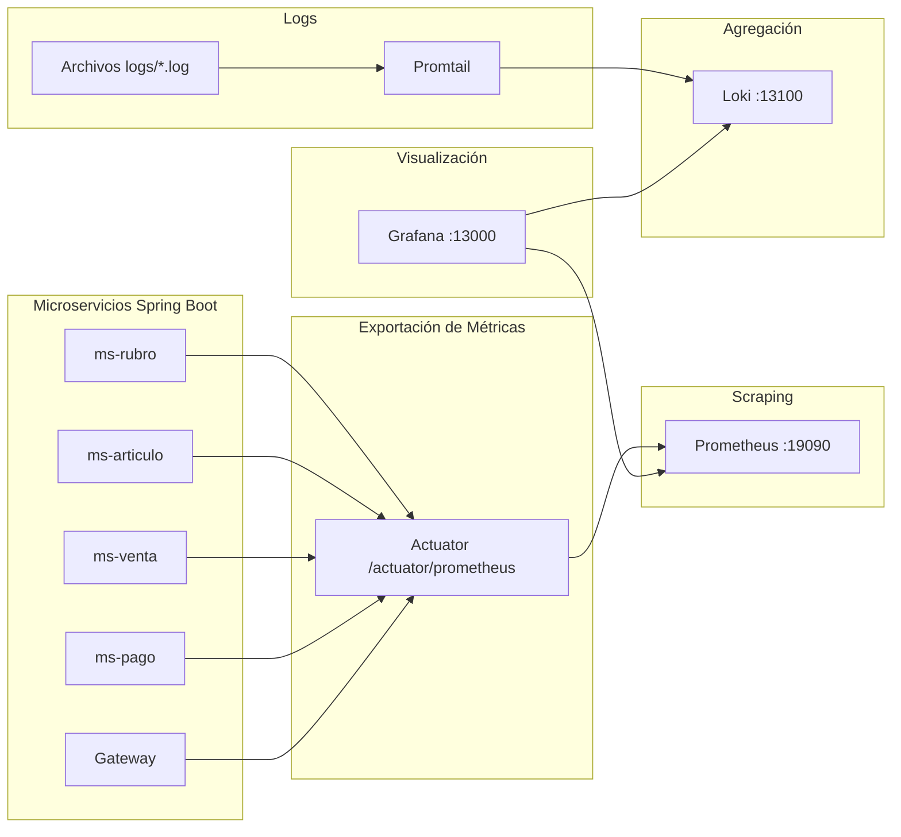

# Observabilidad

NovaMarket expone métricas con **Micrometer + Actuator + Prometheus** y centraliza logs con **Promtail → Loki → Grafana**.

---

## Arquitectura de Observabilidad



---

## Capas

| Capa | Herramienta | DEV | PROD |
|------|-------------|-----|------|
| Exportación | Actuator `/actuator/prometheus` | Por servicio | Por servicio |
| Métricas | Prometheus | http://localhost:19090 | http://localhost:29090 |
| Logs | Loki + Promtail | vía Grafana | vía Grafana |
| Visualización | Grafana | http://localhost:13000 | http://localhost:23000 |

---

## Arranque stack DEV

```powershell
docker network create market-dev-net
cd obs
docker compose -f compose-dev.yml up -d
```

**Verificación:**
- Prometheus: http://localhost:19090
- Grafana: http://localhost:13000 (admin/admin)
- Loki: http://localhost:13100

---

## Endpoints Actuator (por servicio)

| Endpoint | Uso |
|----------|-----|
| `/actuator/health` | Salud (público) |
| `/actuator/prometheus` | Scraping Prometheus |
| `/actuator/metrics` | Lista de métricas disponibles |
| `/actuator/circuitbreakers` | ms-articulo — estado CB |
| `/actuator/circuitbreakerevents` | Eventos Resilience4j |

---

## Prometheus

### Configuración

**URL:** http://localhost:19090

**Targets:** http://localhost:19090/targets

**Jobs DEV:**
- `gateway-dev`
- `ms-articulo-dev`
- `ms-rubro-dev`
- `ms-venta-dev`
- `ms-pago-dev`
- `kafka-exporter-dev`

### Consultas útiles

```promql
# Estado de servicios
up

# Tasa de requests HTTP por servicio
sum by (job) (rate(http_server_requests_seconds_count[1m]))

# Requests al gateway
spring_cloud_gateway_requests_seconds_count{job="gateway-dev"}

# Memoria JVM usada
jvm_memory_used_bytes{job="ms-venta-dev"}

# CPU por servicio
rate(process_cpu_seconds_total[1m]) * 100

# Threads activos
jvm_threads_live_threads

# Tiempo en GC
rate(jvm_gc_pause_seconds_sum[1m])
```

> **Nota:** El gateway (WebFlux) usa `spring_cloud_gateway_*`, no `http_server_requests_*`.

---

## Loki (LogQL)

### Configuración

**URL:** http://localhost:13100

**Labels Promtail:** `service=ms-articulo`, `ms-rubro`, `ms-venta`, `ms-pago`, `gateway`

**Requisito:** Archivos `logs/*.log` generados al correr MS con Maven.

### Consultas útiles

```logql
# Logs de un servicio específico
{service="ms-articulo"} |= "[PRODUCTO]"

# Logs de múltiples servicios
{service=~"gateway|ms-articulo|ms-rubro"}

# Logs con ERROR
{service=~"ms-.*"} |= "ERROR"

# Logs de ventas recientes
{service="ms-venta"} |= "crearVenta"
```

---

## Grafana — Configuración paso a paso

### 1. Conexión a datasources

**Prometheus:**
- URL: `http://prometheus:9090` (Docker) o `http://localhost:19090` (local)
- Access: Server (default)
- Scrape interval: 15s

**Loki:**
- URL: `http://loki:3100` (Docker) o `http://localhost:13100` (local)
- Access: Server (default)

### 2. Dashboard NovaMarket DEV

Dashboard provisionado automáticamente en carpeta **NovaMarket** → **NovaMarket DEV**.

Si no aparece, importar desde `obs/dashboards/novamarket-dev.json`.

### 3. Crear dashboards personalizados

#### Dashboard: Ventas y Métricas de Negocio

**Panel 1: Ventas Completadas (Total)**

```promql
sum(rate(http_server_requests_seconds_count{uri="/api/v1/ventas",method="POST"}[5m]))
```

- Visualization: Stat
- Title: Ventas completadas (últimos 5 min)
- Unit: req/s

**Panel 2: Ventas por Hora**

```promql
sum by (hour) (rate(http_server_requests_seconds_count{uri="/api/v1/ventas",method="POST"}[1h]))
```

- Visualization: Graph
- Title: Ventas por hora
- Legend: {{hour}}

**Panel 3: Ingresos Totales (Estimado)**

```promql
sum(rate(http_server_requests_seconds_count{uri="/api/v1/ventas",method="POST"}[5m])) * 35
```

- Visualization: Stat
- Title: Ingresos estimados (S/) — asumiendo ticket promedio S/35
- Unit: currency PEN

**Panel 4: Unidades Vendidas (Estimado)**

```promql
sum(rate(http_server_requests_seconds_count{uri="/api/v1/ventas",method="POST"}[5m])) * 3
```

- Visualization: Stat
- Title: Unidades vendidas (últimos 5 min) — asumiendo 3 items por venta
- Unit: short

**Panel 5: Top 10 Productos Más Vendidos**

```promql
topk(10, sum by (producto_id) (rate(http_server_requests_seconds_count{uri="/api/v1/articulos"}[1h])))
```

- Visualization: Table
- Title: Top 10 productos más consultados (proxy de ventas)
- Transformations: Organize, Rename by regex

**Panel 6: Distribución por Medio de Pago**

```promql
sum by (medio_pago) (rate(http_server_requests_seconds_count{uri="/api/v1/ventas",method="POST"}[1h]))
```

- Visualization: Pie Chart
- Title: Ventas por medio de pago
- Legend: {{medio_pago}}

**Panel 7: Tiempo de Respuesta de Ventas**

```promql
histogram_quantile(0.95, rate(http_server_requests_seconds_bucket{uri="/api/v1/ventas",method="POST"}[5m]))
```

- Visualization: Graph
- Title: P95 tiempo de respuesta ventas
- Unit: seconds

**Panel 8: Errores en Ventas**

```promql
sum(rate(http_server_requests_seconds_count{uri="/api/v1/ventas",method="POST",status=~"5.."}[5m]))
```

- Visualization: Stat
- Title: Errores en ventas (últimos 5 min)
- Thresholds: 0 (green), 1 (yellow), 5 (red)

#### Dashboard: Salud de Servicios

**Panel 1: Estado de Servicios (UP/DOWN)**

```promql
up
```

- Visualization: Stat
- Title: Servicios UP
- Multi-value: All
- Thresholds: 0 (red), 1 (green)

**Panel 2: CPU por Servicio**

```promql
rate(process_cpu_seconds_total[1m]) * 100
```

- Visualization: Graph
- Title: CPU por servicio (%)
- Legend: {{job}}

**Panel 3: Memoria JVM Usada**

```promql
jvm_memory_used_bytes{area="heap"} / jvm_memory_max_bytes{area="heap"} * 100
```

- Visualization: Graph
- Title: Memoria heap usada (%)
- Legend: {{job}}
- Thresholds: 80 (yellow), 90 (red)

**Panel 4: Threads Activos**

```promql
jvm_threads_live_threads
```

- Visualization: Graph
- Title: Threads activos
- Legend: {{job}}

**Panel 5: GC Pause Time**

```promql
rate(jvm_gc_pause_seconds_sum[1m])
```

- Visualization: Graph
- Title: Tiempo en GC (segundos/min)
- Legend: {{job}}

#### Dashboard: Circuit Breaker (ms-articulo)

**Panel 1: Estado del Circuit Breaker**

```promql
resilience4j_circuitbreaker_state{service="ms-articulo"}
```

- Visualization: Stat
- Title: Estado CB ms-articulo → rubro
- Value mappings: CLOSED (green), OPEN (red), HALF_OPEN (yellow)

**Panel 2: Llamadas Exitosas**

```promql
rate(resilience4j_circuitbreaker_success[1m])
```

- Visualization: Graph
- Title: Llamadas exitosas
- Legend: {{name}}

**Panel 3: Llamadas Fallidas**

```promql
rate(resilience4j_circuitbreaker_failure[1m])
```

- Visualization: Graph
- Title: Llamadas fallidas
- Legend: {{name}}

**Panel 4: Llamadas Rechazadas (Circuit Open)**

```promql
rate(resilience4j_circuitbreaker_calls_rejected[1m])
```

- Visualization: Graph
- Title: Llamadas rechazadas (CB abierto)
- Legend: {{name}}

### 4. Explorar Logs con Loki

**Panel: Logs de Ventas Recientes**

```logql
{service="ms-venta"} |= "crearVenta" | line_format "{{.timestamp}} {{.message}}"
```

- Visualization: Logs
- Title: Logs de ventas
- Time range: Last 15 minutes

**Panel: Errores por Servicio**

```logql
{service=~"ms-.*"} |= "ERROR" | line_format "{{.service}}: {{.message}}"
```

- Visualization: Logs
- Title: Errores por servicio
- Time range: Last 1 hour

### 5. Alertas (Opcional)

**Alerta: Servicio Down**

```yaml
- alert: ServicioDown
  expr: up == 0
  for: 1m
  labels:
    severity: critical
  annotations:
    summary: "Servicio {{ $labels.job }} está down"
```

**Alerta: Alta Tasa de Errores**

```yaml
- alert: AltaTasaErrores
  expr: rate(http_server_requests_seconds_count{status=~"5.."}[5m]) > 0.1
  for: 2m
  labels:
    severity: warning
  annotations:
    summary: "Alta tasa de errores en {{ $labels.job }}"
```

---

## Evidencias (curso)

1. Captura `/actuator/health` (gateway, articulo, rubro)  
2. Prometheus `up` en verde  
3. Grafana: tráfico HTTP o JVM  
4. Loki: logs de una petición `detalle/1`  
5. (Opcional) Circuit breaker en actuator + log fallback
6. **Nuevo:** Dashboard de ventas con métricas de negocio
7. **Nuevo:** Dashboard de salud de servicios
8. **Nuevo:** Logs estructurados en Loki

---

## PROD

```powershell
cd obs
docker compose up -d
```

Grafana: http://localhost:23000 — Prometheus: http://localhost:29090
