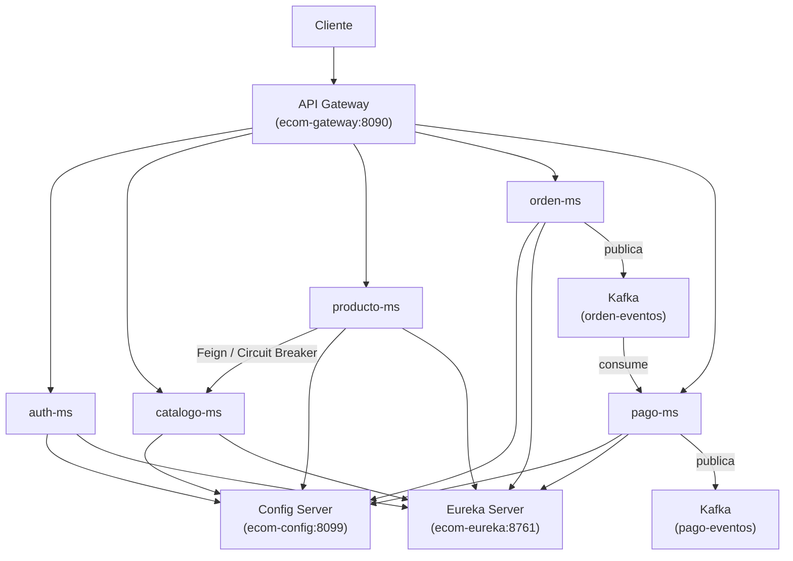
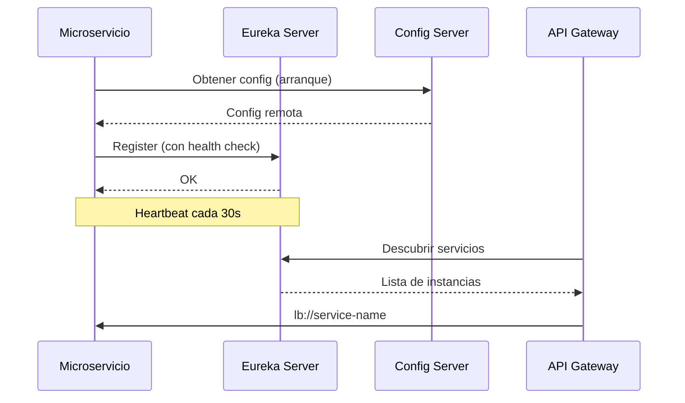

# Infraestructura de Microservicios

Este modulo contiene la infraestructura base de la plataforma:

- Config Server
- Registry Server/Eureka
- Gateway
- `config-repo`
- red compartida `ecom-prod-net`

Kafka, observabilidad y microservicios viven en modulos separados, pero se integran con esta infraestructura.

## Componentes

| Componente | Rol |
|---|---|
| `config-server` | Sirve configuracion centralizada desde `infra/config-repo` |
| `eureka` | Eureka para registro y descubrimiento |
| `gateway` | Punto unico de entrada HTTP y validacion JWT en el borde |
| `config-repo` | Configuracion por servicio y perfil |
| `ecom-prod-net` | Red Docker compartida de produccion |

## Puertos

| Servicio | DEV (Maven) | PROD (Docker) |
|---|---:|---:|
| Config | 8099 | 8099 |
| Eureka | 8761 | 8761 |
| Gateway | 8080 | 8090 |

En Docker prod, los servicios se comunican por nombre interno:

```text
ecom-config:8099
eureka:8761
gateway:8080
```

## Red Compartida

`infra/compose.yml` crea la red:

```text
ecom-prod-net
```

La consumen como red externa:

- `auth-ms`
- `catalogo-ms`
- `producto-ms`
- `orden-ms`
- `pago-ms`
- `kafka`
- `obs`

`infra` debe levantarse primero en prod para crear `ecom-prod-net`.

## Arquitectura

Diagrama general de la plataforma:



### Registro y descubrimiento con Eureka

Cada microservicio se registra en Eureka al arrancar y el gateway descubre las instancias para enrutar peticiones:



## config-repo

Contiene la configuracion externa por servicio y perfil.

Archivos principales:

```text
auth-ms-dev.yml
auth-ms-prod.yml
catalogo-ms-dev.yml
catalogo-ms-prod.yml
producto-ms-dev.yml
producto-ms-prod.yml
registry-server-dev.yml
registry-server-prod.yml
orden-ms-dev.yml
orden-ms-prod.yml
pago-ms-dev.yml
pago-ms-prod.yml
gateway-dev.yml
gateway-prod.yml
eureka-dev.yml
eureka-prod.yml
```

Los microservicios importan Config Server desde su `application.yml`:

```yaml
spring:
  config:
    import: "optional:configserver:${CONFIG_SERVER_URL:http://localhost:8099}"
```

## Servicios Integrados

| Servicio | Config centralizada | Eureka | Gateway | Observability |
|---|---|---|---|---|
| `auth` | si | si | si | si |
| `catalogo` | si | si | si | si |
| `producto` | si | si | si | si |
| `orden-ms` | si | si | si | si |
| `pago-ms` | si | si | si | si |

## Rutas Gateway

Rutas principales:

| Ruta | Servicio |
|---|---|
| `/auth/**` | `auth` |
| `/api/v1/categorias/**` | `catalogo` |
| `/api/v1/productos/**` | `producto` |
| `/ordenes/**` | `orden-ms` |
| `/pagos/**` | `pago-ms` |

En dev tambien se exponen rutas Swagger para los servicios que lo tienen habilitado.

## Seguridad

La seguridad principal esta centralizada en Gateway:

- `/auth/**` es publico.
- Actuator basico del Gateway queda publico para health/info/prometheus.
- Swagger dev queda publico.
- El resto de rutas requiere JWT.

Esto significa que `/ordenes/**` y `/pagos/**` quedan protegidos cuando se accede por Gateway.

Nota: los puertos directos de los microservicios se mantienen para laboratorio y pruebas. Para una produccion mas estricta, se pueden dejar sin publicar y consumirlos solo por `ecom-prod-net`.

## Levantar DEV

En dev normalmente se ejecutan los componentes Java con Maven.

Config Server:

```powershell
cd infra/config-server
mvn spring-boot:run
```

Registry Server:

```powershell
cd infra/registry-server
.\mvnw.cmd spring-boot:run
```

Gateway:

```powershell
cd infra/gateway
.\mvnw.cmd spring-boot:run
```

Validaciones:

```text
http://localhost:8099/catalogo-ms/dev
http://localhost:8099/orden-ms/dev
http://localhost:8099/pago-ms/dev
http://localhost:8761
http://localhost:8090/actuator/health
```

## Levantar PROD

Primero infra:

```powershell
cd infra
docker compose up -d
```

Luego Kafka:

```powershell
cd kafka
docker compose up -d
```

Luego microservicios, por ejemplo:

```powershell
cd services/auth-ms
docker compose up -d

cd services/catalogo-ms
docker compose up -d

cd services/producto-ms
docker compose up -d

cd services/orden-ms
docker compose up -d

cd services/pago-ms
docker compose up -d
```

Finalmente observability:

```powershell
cd obs
docker compose up -d
```

Validaciones:

```text
http://localhost:8099/orden-ms/prod
http://localhost:8099/pago-ms/prod
http://localhost:8761
http://localhost:8090/actuator/health
```

## Observabilidad

`infra` no levanta Prometheus, Loki ni Grafana. Eso vive en `observability`.

La plataforma expone:

- Actuator en Gateway.
- Actuator/Prometheus en microservicios.
- Logs de Gateway en `infra/gateway/logs`.

`observability` consume metricas y logs desde:

- `gateway`
- `catalogo`
- `producto`
- `orden-ms`
- `pago-ms`
- `kafka-exporter`

## Problemas Comunes

### Config no carga

Revisar:

- que Config Server este arriba
- que `CONFIG_SERVER_URL` apunte a `http://ecom-config:8099` en Docker
- que exista el archivo `{spring.application.name}-{profile}.yml` en `config-repo`

### Servicio no aparece en Eureka

Revisar:

- dev: `http://localhost:8761/eureka`
- prod: `http://eureka:8761/eureka`
- que el servicio tenga dependencia Eureka Client

### Gateway no enruta

Revisar:

- que el servicio aparezca en Eureka
- que la ruta exista en `gateway-dev.yml` o `gateway-prod.yml`
- que el JWT sea valido si la ruta no es publica

### Error usando localhost dentro de Docker

Dentro de Docker no usar `localhost` para otros contenedores.

Usar:

- `config`
- `eureka`
- `kafka`
- nombre del servicio en `ecom-prod-net`

## Estado Actual

- [x] Config Server
- [x] Registry Server/Eureka
- [x] Gateway con `lb://`
- [x] Config centralizada para `auth`, `catalogo`, `producto`, `orden-ms`, `pago-ms`
- [x] Red compartida `ecom-prod-net`
- [x] Seguridad JWT en Gateway
- [x] Integracion Kafka para `orden-ms` y `pago-ms`
- [x] Configuracion Eureka dev con `localhost` estable
- [x] Rutas Gateway para `/api/v1/ordenes/**` y `/api/v1/pagos/**`
- [x] Actuator/Prometheus en servicios integrados
- [x] Logs centralizados consumibles por observability
- [ ] Politicas avanzadas de trafico en Gateway
- [ ] Seguridad por microservicio como defensa en profundidad
- [ ] Integracion con frontend

---

## Tag sugerido

```bash
git tag -a vs09-kafka -m "eda con vs09-kafka"
git push origin vs09-kafka
```
