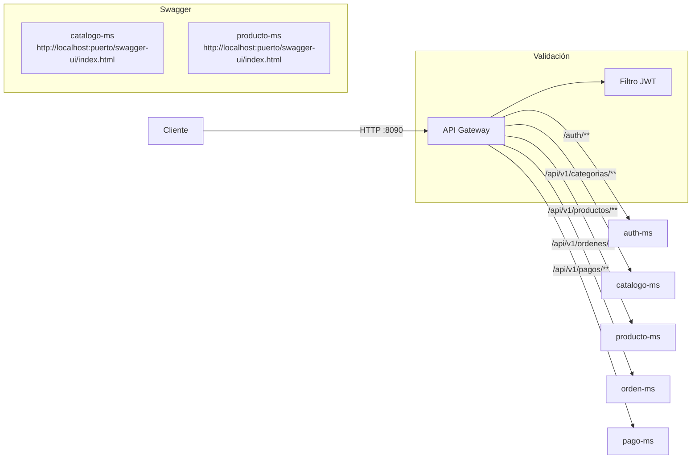

# Gestión del tráfico en el gateway

La gestión del tráfico en un gateway abarca varias funciones clave para controlar, proteger y optimizar el flujo de peticiones entre clientes y microservicios.

## Funciones principales

| Función                  | Descripción                                                                                 |
|--------------------------|--------------------------------------------------------------------------------------------|
| Ruteo (Routing)          | Direcciona las peticiones entrantes al microservicio correspondiente según la ruta o reglas. |
| Balanceo de carga        | Distribuye el tráfico entre múltiples instancias de un servicio para mejorar disponibilidad. |
| CORS                     | Controla qué orígenes pueden acceder a los recursos del backend (Cross-Origin Resource Sharing). |
| Limitación de tasa       | Restringe la cantidad de peticiones permitidas por usuario o IP en un periodo de tiempo.    |
| Circuit breaker          | Protege el sistema de fallos en cascada al bloquear temporalmente servicios inestables.     |
| Reescritura de URLs      | Modifica rutas o encabezados de las peticiones/respuestas según reglas configuradas.        |
| Autenticación/Autorización | Verifica identidad y permisos antes de permitir el acceso a los servicios.                  |
| Filtrado y transformación| Permite modificar, filtrar o enriquecer peticiones y respuestas.                            |
| Monitoreo y logging      | Registra y monitorea el tráfico para análisis, auditoría y detección de problemas.          |

## Ejemplo: Habilitar CORS

Habilitar CORS es una función esencial para permitir que el frontend (por ejemplo, Angular en localhost:4200) acceda a los servicios del backend a través del gateway. Se configura en el gateway agregando los orígenes permitidos.

```java
config.setAllowedOrigins(Arrays.asList(
    "http://localhost:4200",
    "http://localhost:4300"
));
```

Para producción, se debe agregar el dominio real del frontend.

---

## Nota sobre su carácter transversal y evolutivo

La gestión del tráfico es transversal a toda la arquitectura: afecta a todos los servicios y clientes, y se aplica en distintos momentos del ciclo de vida del sistema. Se configura inicialmente al definir el gateway, pero puede y debe ajustarse conforme evolucionan los requisitos, la seguridad, el volumen de usuarios o la integración de nuevos servicios.

Por eso, es común modificar reglas de tráfico, CORS, balanceo, límites o autenticación en diferentes etapas del proyecto.

---

Estas funciones pueden variar según la tecnología del gateway (Spring Cloud Gateway, NGINX, Kong, etc.), pero el objetivo es siempre controlar y optimizar el tráfico entre clientes y microservicios.

## Diagrama de rutas

El gateway enruta cada prefijo de URL al microservicio correspondiente usando el balanceador de carga de Eureka (`lb://`):



Swagger se consulta directo en el puerto asignado a cada microservicio. Para las pruebas de API del curso se usa PowerShell o shell contra el Gateway, no Postman ni Swagger por Gateway.
