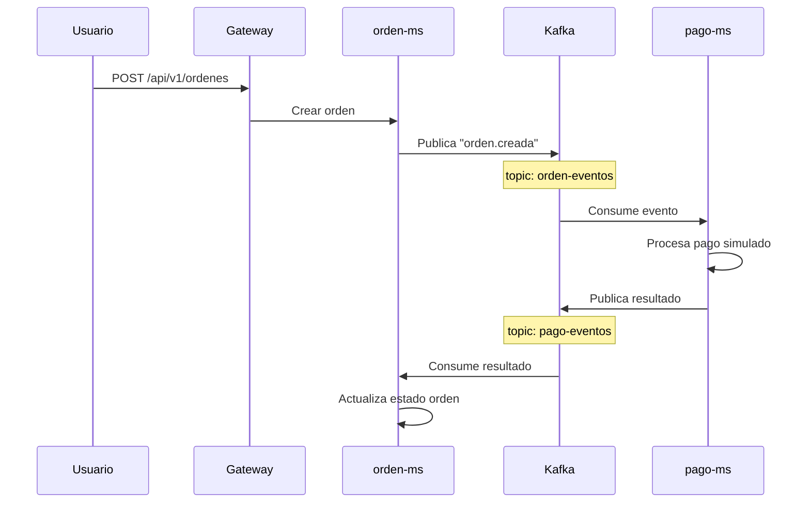

# Sesion U2 S9 P1: Kafka para ingesta en tiempo real

## 1. Título

Implementación de un flujo de ingesta en tiempo real con Apache Kafka, utilizando clientes en Python y Spring Boot para un caso de e-commerce.

## 2. Objetivo

Implementa y valida un flujo básico de ingesta en tiempo real con Apache Kafka, creando y probando un tópico de eventos mediante tres niveles de aprendizaje:

- pruebas manuales de producer y consumer dentro del contenedor del broker
- una práctica intermedia con producer y consumer en Python para pruebas rápidas
- una integración final con microservicios Spring Boot para publicar y consumir mensajes en una arquitectura orientada a eventos

## 3. Herramientas utilizadas

- Apache Kafka
- Docker Compose
- Kafka UI
- Spring Boot
- Java 17
- Python
- Navegador web
- Terminal PowerShell

## 4. Entorno de trabajo

Trabaja sobre el proyecto `kafka` en ambiente `dev` usando:

- Broker Kafka: `localhost:41092`
- Host interno Docker: `kafka:9092`
- Kafka UI: `http://localhost:41085`
- Red Docker: `kafka-ms-dev-net`

También usa estos proyectos complementarios:

- `orden-ms`
- `pago-ms`

## 4.1 Punto de partida de la sesion

Esta sesion parte del corte anterior de seguridad y observabilidad:

```text
infra         -> vs08-auth
auth          -> vs08-auth
producto      -> vs08-auth
catalogo      -> vs07-obs-tools
observability -> vs07-obs-tools
```

Para continuar el desarrollo, usa el monorepo local del curso con esta estructura:

```text
NovaMarket/
├── infra/
├── services/auth-ms/
├── services/producto-ms/
├── services/catalogo-ms/
├── obs/
└── kafka/
```

En esta sesion se agregan o actualizan:

```text
kafka
orden-ms
pago-ms
infra
observability
auth
```

`catalogo` y `producto` se mantienen congelados en sus tags anteriores porque no reciben cambios funcionales de Kafka.

Al finalizar la sesion, el tag sugerido para los repos modificados es:

```bash
git tag -a vs09-kafka -m "eda con vs09-kafka"
git push origin vs09-kafka
```

## 5. Caso de uso

Trabaja con este flujo de e-commerce:



Objetivo del flujo:

- `orden-ms` publica un evento `orden.creada`
- Kafka distribuye el evento
- `pago-ms` consume ese evento
- `pago-ms` procesa el pago y publica un nuevo evento en `pago-eventos`

## 6. Fundamento teórico breve

Ten presentes estos conceptos:

- `topic`: canal lógico donde publicas mensajes
- `producer`: aplicación que envía mensajes a Kafka
- `consumer`: aplicación que lee mensajes desde Kafka
- `broker`: servidor Kafka que almacena y distribuye eventos
- `consumer group`: grupo de consumidores que comparte el progreso de lectura

## 7. Desarrollo de la práctica

Secuencia recomendada para la clase:

```text
1. Explicar el problema: orden-ms no deberia llamar directamente a todos los servicios.
2. Presentar el concepto de evento: "algo ocurrio", por ejemplo orden.creada.
3. Levantar Kafka y revisar Kafka UI.
4. Crear y probar el topic manualmente desde consola.
5. Probar producer/consumer simples con Python.
6. Integrar orden-ms como producer.
7. Integrar pago-ms como consumer y producer.
8. Validar el flujo completo: orden-ms -> Kafka -> pago-ms.
9. Revisar observabilidad basica con kafka-exporter, Prometheus y Grafana.
10. Crear tag vs09-kafka en los repos modificados.
```

### 7.1 Levanta el entorno Kafka

Ubícate en:

```powershell
cd kafka
```

Levanta el stack `dev`:

```powershell
docker compose -f compose-dev.yml up -d
```

Verifica contenedores:

```powershell
docker compose -f compose-dev.yml ps
```

Debes tener disponibles al menos:

- broker Kafka
- Kafka UI
- kafka-exporter

Prometheus y Grafana se levantan desde el modulo `observability`, no desde Kafka.

### 7.2 Crea el tópico de trabajo

Ingresa al broker:

> Ejecuta este comando desde `PS kafka>`. Docker Compose necesita encontrar el archivo `compose-dev.yml` en la carpeta actual.

```powershell
docker compose -f compose-dev.yml exec kafka bash
```

Si estas en otra ruta, primero entra a la carpeta:

```powershell
cd kafka
```

Luego ejecuta el comando anterior.

Tambien puedes entrar desde cualquier carpeta usando `docker exec -it <nombre-real-del-contenedor> bash`, copiando el nombre desde `docker ps`. En este curso se recomienda `docker compose exec` para trabajar con el nombre del servicio.

Crea el tópico `orden-eventos`:

```bash
/opt/kafka/bin/kafka-topics.sh --create \
  --topic orden-eventos \
  --bootstrap-server kafka:9092 \
  --partitions 1 \
  --replication-factor 1
```

Lista los tópicos:

```bash
/opt/kafka/bin/kafka-topics.sh --list \
  --bootstrap-server kafka:9092
```

Resultado esperado:

```text
orden-eventos
```

### 7.3 Prueba producer y consumer manuales

Dentro del contenedor del broker, ejecuta el producer:

```bash
/opt/kafka/bin/kafka-console-producer.sh \
  --topic orden-eventos \
  --bootstrap-server kafka:9092
```

Escribe un mensaje simple:

```text
hola
```

En otra terminal, entra nuevamente al contenedor y ejecuta el consumer:

```bash
/opt/kafka/bin/kafka-console-consumer.sh \
  --topic orden-eventos \
  --bootstrap-server kafka:9092 \
  --from-beginning
```

Verifica que el mensaje `hola` aparezca en el consumer.

### 7.4 Integra Kafka con Spring Boot

Antes de ejecutar `orden-ms` y `pago-ms`, levanta la infraestructura base en `dev` porque ambos leen configuracion desde Config Server y se registran en Eureka.

Terminal para Config Server:

```powershell
cd infra/config-server
.\mvnw.cmd spring-boot:run
```

Terminal para Registry Server:

```powershell
cd infra/registry-server
.\mvnw.cmd spring-boot:run
```

#### Paso A. Usa `orden-ms` como producer

Ubícate en:

```powershell
cd services/orden-ms
```

Levanta MySQL de desarrollo:

```powershell
docker compose -f compose-dev.yml up -d
```

Ejecuta la aplicación:

```powershell
.\mvnw.cmd spring-boot:run
```

Envía una orden:

```powershell
Invoke-RestMethod `
  -Method Post `
  -Uri "http://localhost:19051/api/v1/ordenes" `
  -ContentType "application/json" `
  -Body '{"usuarioId":1,"total":100}'
```

Evento esperado en Kafka:

```json
{"tipoEvento":"orden.creada","ordenId":1,"total":100.0,"estado":"PENDIENTE","origen":"orden-ms","timestamp":1713350000000}
```

#### Paso B. Usa `pago-ms` como consumer y producer

Ubícate en:

```powershell
cd services/pago-ms
```

Levanta MySQL de desarrollo:

```powershell
docker compose -f compose-dev.yml up -d
```

Ejecuta la aplicación:

```powershell
.\mvnw.cmd spring-boot:run
```

Verifica que:

- `pago-ms` consuma `orden-eventos`
- procese el pago
- publique un nuevo evento en `pago-eventos`

Ejemplo de salida esperada:

```json
{
  "tipoEvento": "pago.aprobado",
  "ordenId": 1,
  "monto": 150.0,
  "estado": "APROBADO",
  "origen": "pago-ms",
  "timestamp": 1713350000000
}
```

## 8. Qué aprende el alumno

Al finalizar la sesión, el alumno debe comprender:

- cómo crear y usar tópicos Kafka
- cómo funciona un producer
- cómo funciona un consumer
- diferencia entre host externo `localhost:41092` y host interno `kafka:9092`
- diferencia entre pruebas manuales, cliente Python e integración Spring Boot
- cómo se integra Kafka en una arquitectura orientada a eventos

## 9. Evidencias a entregar

Adjunta como evidencia:

- captura del `docker compose -f compose-dev.yml ps` del entorno Kafka
- captura de Kafka UI con el tópico `orden-eventos`
- captura del producer y consumer manual en consola
- captura o salida del `POST /api/v1/ordenes` en `orden-ms`
- evidencia del consumo y publicación en `pago-ms`

## 10. Actividad de aprendizaje autónomo

Documenta el contrato del evento `orden.creada`, incluyendo:

- campos
- tipos
- ejemplo de payload
- productor del evento
- consumidor del evento
- tópico utilizado
- estrategia inicial de particionado del tópico

## 11. Cierre

Si la práctica salió correctamente, debes haber validado tres formas de trabajar con Kafka:

- desde consola dentro del broker
- desde un cliente Python simple
- desde microservicios Spring Boot


